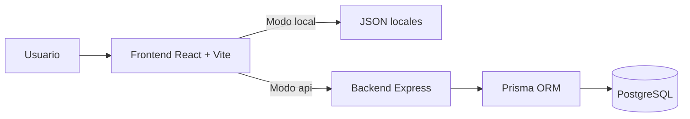
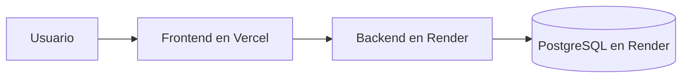

# SportMetric Academic

SportMetric Academic es una plataforma web academica orientada a la consulta guiada de protocolos de medicion fisica y antropometrica. El proyecto evoluciono desde una SPA apoyada en archivos JSON locales hacia una arquitectura full stack desacoplada, con frontend en React, backend en Express y persistencia en PostgreSQL.

Este repositorio concentra la base tecnica del sistema, la documentacion de ingenieria y la preparacion necesaria para una siguiente fase de integracion real con formularios y persistencia de datos.

## Resumen ejecutivo

Hoy el proyecto ya permite:

- navegar categorias y protocolos desde el frontend;
- consultar esos datos desde archivos locales o desde la API;
- poblar PostgreSQL con un seed controlado;
- exponer endpoints de lectura estables para categorias y protocolos;
- desplegar frontend y backend por separado sin acoplar el codigo a un proveedor especifico.

Todavia no implementa:

- persistencia de formularios;
- autenticacion completa en frontend;
- panel administrativo;
- operaciones CRUD completas para gestion de contenido.

## Estado actual

| Componente | Estado | Descripcion |
| --- | --- | --- |
| Frontend | Listo | Navegacion, UI y consumo en modo `local` o `api`, validado con lint, cobertura y build. |
| Backend | Listo | API Express + TypeScript + Prisma con endpoints de lectura, validada con lint, cobertura, build y smoke tests reales. |
| Base de datos | Lista | PostgreSQL con migraciones y seed funcional. |
| Documentacion | Completa | Guias de arquitectura, despliegue, base de datos, API, pruebas y diagramas. |
| Formularios | Pendiente | La estructura se dejo preparada, pero aun no se implementan. |

## Estado verificado recientemente

En la validacion mas reciente se comprobo que:

- frontend y backend levantan correctamente en local;
- `GET /api/health`, `GET /api/categories` y `GET /api/protocols/:id` responden bien en runtime;
- la navegacion principal de la SPA funciona en navegador y no arroja errores reales de consola;
- GitHub Actions ya exige `lint`, `test:coverage` y `build` en frontend y backend;
- el build del backend copia el cliente Prisma generado a `dist/` para que `npm start` use un runtime funcional.

## Objetivo de esta etapa

Esta etapa se cerro con cuatro metas principales:

1. dejar una base tecnica estable;
2. preparar el proyecto para despliegue desacoplado;
3. mantener portabilidad entre proveedores;
4. documentar el funcionamiento y la operacion de forma clara.

## Arquitectura general



### Principios aplicados

- separacion clara entre frontend, backend y base de datos;
- arquitectura por capas en backend;
- frontend desacoplado del origen de datos;
- configuracion por variables de entorno;
- enfoque cloud agnostic para facilitar cambios futuros de infraestructura.

## Estructura del repositorio

```text
/
|-- .github/
|   `-- workflows/ci.yml
|-- backend/
|   |-- prisma/
|   |-- scripts/
|   |-- src/
|   |-- .env.example
|   `-- package.json
|-- frontend/
|   |-- public/
|   |-- src/
|   |-- .env.example
|   `-- package.json
|-- docs/
|-- docs-engineering/
|   |-- adr/
|   |-- api/
|   |-- architecture/
|   |-- database/
|   |-- deployment/
|   |-- testing/
|   `-- diagrams/
|-- docker/
|-- README.md
|-- README-backend.md
|-- README-frontend.md
`-- .gitignore
```

## Stack tecnologico

### Frontend

- React 19
- Vite
- React Router
- Tailwind CSS
- Framer Motion
- Lucide React
- Vitest
- ESLint

### Backend

- Node.js 22.x
- Express 5
- TypeScript
- Prisma 7
- PostgreSQL 16
- Pino
- Zod
- Swagger / OpenAPI
- Vitest + Supertest
- ESLint

## Como funciona el sistema hoy

El frontend puede operar de dos maneras.

### Modo `local`

Lee los archivos del propio proyecto:

- `frontend/src/data/categories.js`
- `frontend/src/data/protocols/*.json`

Este modo es util para:

- revision visual;
- validacion rapida de contenido;
- trabajo sin depender del backend.

### Modo `api`

Consulta el backend mediante HTTP. En este caso, el backend obtiene la informacion desde PostgreSQL a traves de Prisma.

Este modo es util para:

- validar contratos reales entre frontend y backend;
- preparar despliegue productivo;
- avanzar hacia persistencia futura.

## Arranque rapido local

### 1. Requisitos

- Node.js 22.x
- npm 10+ u 11+
- PostgreSQL 16

### 2. Levantar el backend

Entrar a `backend/`, configurar el entorno y ejecutar:

```bash
npm install
npm run db:migrate:dev
npm run db:seed
npm run dev
```

Servicios locales del backend:

- API: `http://localhost:3001`
- Health check: `http://localhost:3001/api/health`
- Swagger: `http://localhost:3001/api/docs`

### 3. Levantar el frontend

Entrar a `frontend/` y ejecutar:

```bash
npm install
npm run dev
```

Aplicacion local:

- Frontend: `http://localhost:5173`

### 4. Configuracion minima de variables

### Backend

Archivo base: `backend/.env.example`

Variables clave:

- `DATABASE_URL`
- `BACKEND_PUBLIC_URL`
- `FRONTEND_URL`
- `ALLOWED_ORIGINS`
- `JWT_SECRET`
- `JWT_REFRESH_SECRET`

### Frontend

Archivo base: `frontend/.env.example`

Variables clave:

- `VITE_DATA_SOURCE`
- `VITE_API_BASE_URL`

## Modos de operacion del frontend

### Opcion 1: seguir trabajando con datos locales

```env
VITE_DATA_SOURCE=local
```

### Opcion 2: consumir la API local

```env
VITE_DATA_SOURCE=api
VITE_API_BASE_URL=http://localhost:3001
```

## Endpoints disponibles

### Salud

- `GET /api/health`

### Categorias

- `GET /api/categories`
- `GET /api/categories/:id`
- `GET /api/categories/:id/protocols`

### Protocolos

- `GET /api/protocols`
- `GET /api/protocols/:id`

## Despliegue recomendado

La estrategia mas simple y coherente para este proyecto es:

- frontend en Vercel;
- backend en Render;
- PostgreSQL en Render.



Puntos importantes:

- el frontend no debe conectarse directamente a la base de datos;
- Render crea la instancia de PostgreSQL, pero las tablas las crean las migraciones de Prisma;
- el build del backend ya deja el cliente Prisma copiado en `dist/generated/prisma`;
- el seed se ejecuta de forma controlada cuando se necesite poblar contenido base.

## Portabilidad futura

El proyecto quedo preparado para mover infraestructura sin reescribir la logica principal:

- frontend a Vercel, Netlify o Render Static Site;
- backend a Render, Railway, Fly.io, AWS, Azure o GCP;
- PostgreSQL a Render, Neon, Supabase, Railway o RDS.

Esto es posible porque:

- la configuracion depende de variables de entorno;
- Prisma centraliza el acceso a datos mediante `DATABASE_URL`;
- CORS se controla por configuracion;
- el frontend solo necesita `VITE_API_BASE_URL` para cambiar de backend.

## Auditoria y pruebas

Antes de preparar commits o despliegues, conviene ejecutar esta validacion minima:

### Frontend

```bash
cd frontend
npm install
npm run lint
npm run test:coverage
npm run build
```

### Backend

```bash
cd backend
npm install
npm run lint
npm run test:coverage
npm run build
```

Estas pruebas validan:

- contratos, servicios y componentes principales del frontend;
- configuracion, servicios, repositorios y contrato HTTP del backend;
- cobertura minima exigida en Vitest;
- builds reales utilizables en despliegue y en `npm start`;
- compatibilidad con el pipeline de GitHub Actions.

Cobertura verificada:

- Frontend: `91.11%` statements, `75.23%` branches, `83.2%` functions, `94.02%` lines.
- Backend: `96.35%` statements, `79.62%` branches, `96.66%` functions, `96.21%` lines.

## Troubleshooting rapido

### El backend no levanta

Revisar:

- `backend/.env`
- `DATABASE_URL`
- `JWT_SECRET`
- `JWT_REFRESH_SECRET`
- `ALLOWED_ORIGINS`

### Prisma no conecta a PostgreSQL

Verificar:

- que PostgreSQL este activo;
- que el puerto sea correcto;
- que el usuario y la contrasena sean correctos;
- que exista la base `sportmetric`;
- que la `DATABASE_URL` este bien formada.

### El backend levanta en desarrollo, pero `npm start` falla

Revisar que el ultimo build se haya ejecutado con:

```bash
npm run build
```

Ese proceso ahora genera Prisma Client y lo copia a `dist/generated/prisma`, que es lo que consume el runtime compilado.

### El frontend no carga datos desde la API

Verificar:

- `VITE_DATA_SOURCE=api`
- `VITE_API_BASE_URL`
- que el backend este corriendo;
- que `ALLOWED_ORIGINS` incluya el origen del frontend.

### La base existe, pero no hay tablas

Ejecutar:

```bash
npm run db:migrate:dev
```

o en produccion:

```bash
npm run db:migrate:deploy
```

### Hay tablas, pero no hay categorias ni protocolos

Ejecutar:

```bash
npm run db:seed
```

## Documentacion tecnica relacionada

- `README-backend.md`
- `README-frontend.md`
- `docs-engineering/architecture/arquitectura-general.md`
- `docs-engineering/api/estado-api.md`
- `docs-engineering/database/operacion-postgresql-prisma.md`
- `docs-engineering/deployment/render-vercel.md`
- `docs-engineering/testing/auditoria-y-pruebas.md`
- `docs-engineering/diagrams/indice-diagramas.md`
- `docs-engineering/adr/`

## Siguiente etapa prevista

La base quedo lista para pasar a una siguiente fase de implementacion, pero se decidio posponerla hasta cerrar requerimientos funcionales:

- persistencia de formularios;
- definicion exacta de campos;
- validaciones de negocio;
- flujo operativo real que necesite el equipo academico.
