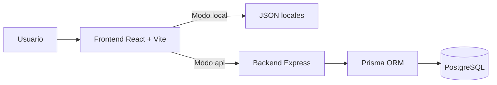
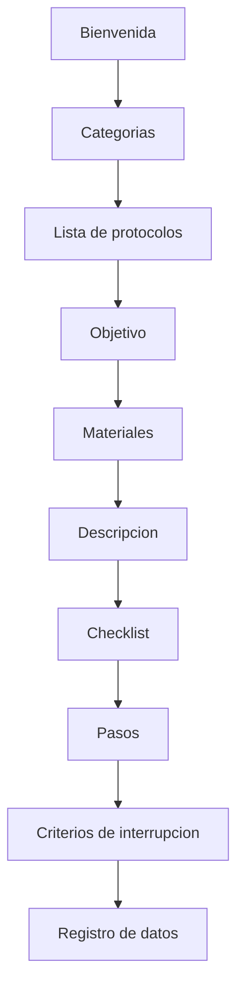
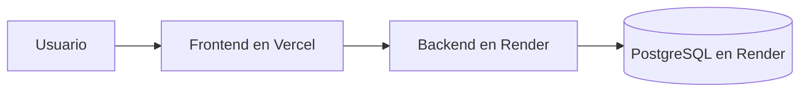

# SportMetric Academic

Plataforma web academica para consulta guiada de protocolos de medicion fisica y antropometrica.

El proyecto evoluciono desde una SPA basada en archivos JSON hacia una arquitectura full stack desacoplada, con `frontend` en React, `backend` en Express y persistencia en PostgreSQL. La meta de esta etapa fue dejar una base tecnica estable, portable y bien documentada, lista para seguir creciendo sin acoplarla a un proveedor especifico.

## Vista rapida

| Area | Estado | Nota |
| --- | --- | --- |
| Frontend | Listo | Navegacion, UI y consumo en modo `local` o `api`. |
| Backend | Listo | API de lectura con Express, Prisma y PostgreSQL. |
| Base de datos | Lista | Migraciones y seed funcionales. |
| Calidad | Validada | `lint`, `test:coverage` y `build` en frontend y backend. |
| CI | Activa | GitHub Actions valida instalacion, calidad, cobertura y build. |
| Formularios persistentes | Pendiente | La base esta preparada, pero aun no se implementan. |

## Que resuelve hoy

- navegacion guiada de categorias y protocolos;
- lectura de datos desde archivos locales o desde la API;
- detalle de protocolo por secciones academicas;
- seed inicial de PostgreSQL con el contenido base del proyecto;
- despliegue desacoplado de frontend y backend;
- validacion tecnica real con cobertura minima y checks en CI.

## Lo que todavia no incluye

- persistencia de formularios en produccion;
- autenticacion y autorizacion completas;
- panel administrativo;
- CRUD de contenido desde interfaz web.

## Arquitectura general



### Principios aplicados

- separacion clara entre frontend, backend y base de datos;
- configuracion por variables de entorno;
- frontend desacoplado del origen de datos;
- arquitectura por capas en backend;
- enfoque cloud agnostic para despliegue futuro.

## Flujo funcional

La experiencia principal disponible hoy es:

`Bienvenida -> Categorias -> Lista de protocolos -> Objetivo -> Materiales -> Descripcion -> Checklist -> Pasos -> Interrupcion -> Registro de datos`



Cada protocolo puede mostrar solo las secciones que realmente tenga definidas, manteniendo una navegacion consistente sin hardcodear contenido academico en componentes.

## Stack tecnologico

### Frontend

- React 19
- Vite
- React Router
- Tailwind CSS
- Framer Motion
- Lucide React
- Vitest
- ESLint

### Backend

- Node.js 22.x
- Express 5
- TypeScript
- Prisma 7
- PostgreSQL 16
- Pino
- Zod
- Swagger / OpenAPI
- Vitest + Supertest
- ESLint

## Estructura del repositorio

```text
/
|-- .github/
|   `-- workflows/ci.yml
|-- backend/
|   |-- prisma/
|   |-- scripts/
|   |-- src/
|   |-- .env.example
|   `-- package.json
|-- frontend/
|   |-- public/
|   |-- src/
|   |-- .env.example
|   `-- package.json
|-- docs/
|-- docs-engineering/
|   |-- adr/
|   |-- api/
|   |-- architecture/
|   |-- database/
|   |-- deployment/
|   |-- testing/
|   `-- diagrams/
|-- docker/
|-- README.md
|-- README-backend.md
|-- README-frontend.md
`-- .gitignore
```

## Como funciona el sistema

### Modo `local`

El frontend lee directamente:

- `frontend/src/data/categories.js`
- `frontend/src/data/protocols/*.json`

Este modo sirve para trabajo visual, revision de contenido y pruebas rapidas sin depender del backend.

### Modo `api`

El frontend consulta el backend por HTTP y este obtiene la informacion desde PostgreSQL a traves de Prisma.

Este modo sirve para:

- validar contratos reales entre frontend y backend;
- preparar despliegue productivo;
- avanzar hacia persistencia futura.

## Modelo de contenido

La fuente funcional del contenido parte de:

- `frontend/src/data/categories.js`
- `frontend/src/data/protocols/*.json`
- `backend/prisma/seed.ts`

El flujo actual es:

1. el frontend puede usar contenido local;
2. el seed toma ese contenido base y lo lleva a PostgreSQL;
3. el backend expone categorias y protocolos desde la base;
4. el frontend puede cambiar de origen usando solo variables de entorno.

Los protocolos siguen una estructura academica estable con campos como:

- `objective`
- `materials`
- `description`
- `checklist`
- `steps`
- `interruptionCriteria`
- `dataRegistry`

## Arranque rapido local

### Requisitos

- Node.js 22.x
- npm 10+ o 11+
- PostgreSQL 16

### 1. Levantar backend

Desde `backend/`:

```bash
npm install
npm run db:migrate:dev
npm run db:seed
npm run dev
```

Servicios disponibles:

- API: `http://localhost:3001`
- Health: `http://localhost:3001/api/health`
- Swagger: `http://localhost:3001/api/docs`

### 2. Levantar frontend

Desde `frontend/`:

```bash
npm install
npm run dev
```

Aplicacion local:

- Frontend: `http://localhost:5173`

## Configuracion minima

### Backend

Archivo base: `backend/.env.example`

Variables clave:

- `DATABASE_URL`
- `BACKEND_PUBLIC_URL`
- `FRONTEND_URL`
- `ALLOWED_ORIGINS`
- `JWT_SECRET`
- `JWT_REFRESH_SECRET`
- `TRUST_PROXY_HOPS`

### Frontend

Archivo base: `frontend/.env.example`

Variables clave:

- `VITE_DATA_SOURCE`
- `VITE_API_BASE_URL`

## Modos de operacion del frontend

### Opcion 1: datos locales

```env
VITE_DATA_SOURCE=local
```

### Opcion 2: consumo de API

```env
VITE_DATA_SOURCE=api
VITE_API_BASE_URL=http://localhost:3001
```

## Endpoints disponibles

### Salud

- `GET /api/health`

### Categorias

- `GET /api/categories`
- `GET /api/categories/:id`
- `GET /api/categories/:id/protocols`

### Protocolos

- `GET /api/protocols`
- `GET /api/protocols/:id`

## Calidad, auditoria y estado verificado

En la validacion mas reciente se comprobo que:

- frontend y backend levantan correctamente en local;
- `GET /api/health`, `GET /api/categories` y `GET /api/protocols/:id` responden correctamente en runtime;
- la navegacion principal del frontend funciona sin errores reales de consola en las vistas revisadas;
- GitHub Actions valida `lint`, `test:coverage` y `build` en ambos paquetes;
- el build del backend deja Prisma listo para que `npm start` funcione sobre `dist/`;
- Vercel ya tiene fallback SPA para rutas profundas mediante `rewrites` en `vercel.json`.

### Comandos de validacion

#### Frontend

```bash
cd frontend
npm install
npm run lint
npm run test:coverage
npm run build
```

#### Backend

```bash
cd backend
npm install
npm run lint
npm run test:coverage
npm run build
```

### Cobertura verificada

| Paquete | Statements | Branches | Functions | Lines |
| --- | ---: | ---: | ---: | ---: |
| Frontend | 91.11% | 75.23% | 83.2% | 94.02% |
| Backend | 96.35% | 79.62% | 96.66% | 96.21% |

## Scripts principales

### Frontend

- `npm run dev`
- `npm run lint`
- `npm run test`
- `npm run test:run`
- `npm run test:coverage`
- `npm run build`

### Backend

- `npm run dev`
- `npm run lint`
- `npm run test`
- `npm run test:coverage`
- `npm run build`
- `npm run db:migrate:dev`
- `npm run db:migrate:deploy`
- `npm run db:seed`

## Despliegue recomendado

La estrategia mas simple y coherente hoy es:

- frontend en Vercel;
- backend en Render;
- PostgreSQL en Render.



### Consideraciones importantes

- el frontend no debe conectarse directamente a la base de datos;
- Prisma crea y consume el modelo de datos a traves de migraciones;
- el backend ya compila Prisma Client y lo copia a `dist/generated/prisma`;
- el proyecto puede moverse a otros proveedores cambiando variables de entorno, sin reescribir la logica principal;
- el frontend depende de `VITE_API_BASE_URL` y de un rewrite SPA a `index.html`;
- el backend depende de `DATABASE_URL`, CORS y `TRUST_PROXY_HOPS`, no del proveedor.

## Portabilidad

La base actual permite cambiar infraestructura con bajo impacto:

- frontend a Vercel, Netlify o Render Static Site;
- backend a Render, Railway, Fly.io, AWS, Azure o GCP;
- PostgreSQL a Render, Neon, Supabase, Railway o RDS.

## Migrar de proveedor

La migracion no deberia requerir cambios de codigo si se respeta esta lista:

### Mover frontend a otro host

1. configurar build con `npm ci` y `npm run build` dentro de `frontend`;
2. publicar `frontend/dist`;
3. definir `VITE_DATA_SOURCE=api`;
4. definir `VITE_API_BASE_URL` con la URL publica del backend;
5. configurar fallback SPA para enviar rutas profundas a `index.html`;
6. validar rutas como `/categories`, `/category/:id` y `/protocol/:id/objective`.

### Mover backend a otro host

1. configurar build con `npm ci` y `npm run build` dentro de `backend`;
2. arrancar con `npm run start`;
3. definir `DATABASE_URL`, `BACKEND_PUBLIC_URL`, `FRONTEND_URL`, `ALLOWED_ORIGINS`, `JWT_SECRET`, `JWT_REFRESH_SECRET`;
4. ajustar `TRUST_PROXY_HOPS` segun la cantidad real de proxies delante del servicio;
5. ejecutar migraciones con `npm run db:migrate:deploy`;
6. validar `GET /api/health`, `GET /api/categories` y `GET /api/protocols/:id`.

### Checklist post-migracion

- confirmar que el frontend carga datos reales desde la API;
- confirmar que CORS permite el nuevo dominio del frontend;
- confirmar que el backend responde con la URL publica nueva;
- confirmar que las rutas profundas del frontend no devuelven 404;
- volver a ejecutar `lint`, `test:coverage` y `build`.

## Sistema de assets y referencias funcionales

Fuentes utiles para continuar trabajo visual y academico:

- assets publicos: `frontend/public/assets/`
- mockups: `docs/Desing mockups UI UX/`
- sistema de diseno: `docs/DESIGN.md`
- flujo funcional: `docs/APP_FLOW.md`
- estructura de protocolos: `docs/PROTOCOL_STRUCTURE.md`

## Troubleshooting

### El backend no levanta

Revisar:

- `backend/.env`
- `DATABASE_URL`
- `JWT_SECRET`
- `JWT_REFRESH_SECRET`
- `ALLOWED_ORIGINS`

### Prisma no conecta a PostgreSQL

Verificar:

- que PostgreSQL este activo;
- que el puerto sea correcto;
- que el usuario y la contrasena sean correctos;
- que exista la base `sportmetric`;
- que la `DATABASE_URL` este bien formada.

### `npm start` del backend falla despues de compilar

Ejecutar:

```bash
npm run build
```

Ese proceso genera Prisma Client y lo copia a `dist/generated/prisma`, que es lo que consume el runtime compilado.

### El frontend no carga datos desde la API

Verificar:

- `VITE_DATA_SOURCE=api`
- `VITE_API_BASE_URL`
- que el backend este corriendo;
- que `ALLOWED_ORIGINS` incluya el origen del frontend.

### El frontend carga en `/`, pero falla al refrescar una ruta interna

Verificar que el host del frontend tenga configurado el fallback SPA hacia `index.html`.

### La base existe, pero no hay tablas

Ejecutar:

```bash
npm run db:migrate:dev
```

o en produccion:

```bash
npm run db:migrate:deploy
```

### Hay tablas, pero no hay categorias ni protocolos

Ejecutar:

```bash
npm run db:seed
```

## Documentacion relacionada

- `README-backend.md`
- `README-frontend.md`
- `docs/DESIGN.md`
- `docs/APP_FLOW.md`
- `docs/PROJECT_CONTEXT.md`
- `docs/PROTOCOL_STRUCTURE.md`
- `docs-engineering/architecture/arquitectura-general.md`
- `docs-engineering/api/estado-api.md`
- `docs-engineering/database/operacion-postgresql-prisma.md`
- `docs-engineering/deployment/render-vercel.md`
- `docs-engineering/testing/auditoria-y-pruebas.md`
- `docs-engineering/diagrams/indice-diagramas.md`
- `docs-engineering/adr/`

## Proxima etapa

La base ya esta lista para continuar con una siguiente fase funcional:

- persistencia de formularios;
- definicion exacta de campos;
- validaciones de negocio;
- flujo operativo real del equipo academico.

## Estrategia de ramas

- `main`: referencia principal y rama estable.
- `dev`: integracion y evolucion del trabajo tecnico.

La recomendacion es validar cambios en `dev` y promover a `main` solo cuando los checks y la revision funcional esten en verde.
