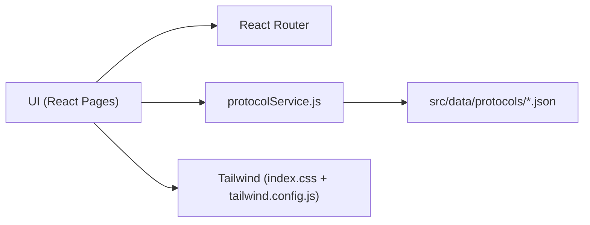
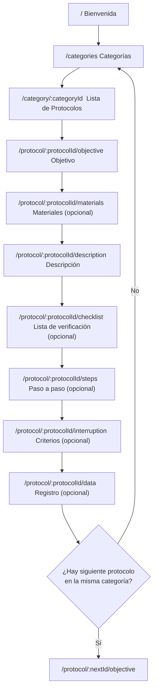

# SportMetric Academic

Repositorio de una app web para consulta guiada de protocolos de medición física y antropométrica. La UI se basa en el sistema de diseño definido en `docs/DESIGN.md` y el contenido de protocolos se consume desde JSON en `src/data/protocols/*.json`.

---

## 1) Información general del proyecto

### Nombre del proyecto

SportMetric Academic

### Descripción general

Aplicación web mobile-first orientada a navegar un flujo académico de protocolos (objetivo → materiales → descripción → checklist → pasos → criterios → registro).

### Objetivo del proyecto

Estandarizar la consulta de protocolos de medición y reducir ambigüedades en el procedimiento, mostrando el contenido de forma guiada y consistente.

### Público objetivo

- Investigadores / docentes de ciencias del deporte
- Estudiantes en prácticas y evaluaciones académicas
- Personal técnico que consulta protocolos estandarizados

### Estado actual del proyecto

- Funcional (navegación principal y renderizado por JSON).
- Placeholders usados para recursos multimedia mientras se incorporan assets finales.
- Extracción Excel → JSON disponible como tooling local.

### Alcance del proyecto

- Navegación del flujo oficial de protocolos.
- Renderizado data-driven desde JSON (sin “inventar” contenido).
- Soporte de categorías y avance automático al siguiente protocolo dentro de la misma categoría.
- No incluye (por ahora): autenticación, roles, sincronización a backend, persistencia real de registros.

---

## 2) Stack tecnológico

### Frontend

- Framework: React `19.2.6`
- Router: React Router DOM `7.15.1`
- Lenguaje: JavaScript (ESM)
- Bundler/Dev Server: Vite `8.0.14`
- Gestor de paquetes: npm
- Node.js: recomendado `22.x` (LTS) + npm `11.x` o equivalente

### UI / UX

- Framework CSS: TailwindCSS `3.4.19` (PostCSS `8.5.15` + Autoprefixer `10.5.0`)
- Animación: framer-motion `12.40.0`
- Íconos: lucide-react `1.16.0`
- Utilidades de clases: clsx `2.1.1`, tailwind-merge `3.6.0`

---

## 3) Arquitectura del proyecto

### Arquitectura utilizada

- Component Driven Development (componentes por pantalla/sección).
- Data Driven UI: protocolos renderizados desde JSON.
- Mobile First Design: navegación inferior en móvil y navegación superior en desktop.

### Principios utilizados

- Single Source of Truth para contenido: `src/data/protocols/*.json`.
- Separación de responsabilidades:
  - “Pages” orquestan flujo/rutas.
  - “Services” resuelven carga/orden de datos.
  - “Data” contiene catálogos y protocolos.
  - “Styles” define utilidades y componentes visuales base.

### Diagrama de arquitectura (Mermaid)



---

## 4) Estructura de carpetas

Estructura actual del proyecto (carpetas principales):

```text
/
├── docs/
│   ├── DESIGN.md
│   ├── APP_FLOW.md
│   ├── PROJECT_CONTEXT.md
│   ├── PROTOCOL_STRUCTURE.md
│   └── Desing mockups UI UX/
├── src/
│   ├── components/
│   │   └── navigation/
│   │       ├── Header.jsx
│   │       └── BottomNav.jsx
│   ├── data/
│   │   ├── categories.js
│   │   └── protocols/
│   │       └── *.json
│   ├── layout/
│   │   └── MainLayout.jsx
│   ├── pages/
│   │   ├── Welcome.jsx
│   │   ├── Categories.jsx
│   │   ├── ProtocolList.jsx
│   │   ├── ProtocolDetail.jsx
│   │   └── protocol/
│   │       ├── ProtocolObjective.jsx
│   │       ├── ProtocolMaterials.jsx
│   │       ├── ProtocolDescription.jsx
│   │       ├── ProtocolChecklist.jsx
│   │       ├── ProtocolSteps.jsx
│   │       ├── ProtocolInterruption.jsx
│   │       └── ProtocolDataRegistry.jsx
│   ├── services/
│   │   └── protocolService.js
│   ├── styles/
│   │   └── index.css
│   ├── App.jsx
│   └── main.jsx
├── extract_xlsx.js
├── OVA_TRACKER.xlsx (local, no se sube al repo)
├── package.json
└── vite.config.js
```

Notas:

- El árbol de ejemplo propuesto (`src/hooks`, `src/utils`, `src/types`, `src/assets`) todavía no existe en este repositorio. Si se incorporan, deben documentarse aquí y moverse las responsabilidades correspondientes.

---

## 5) Flujo funcional (vistas)

El flujo oficial:

Bienvenida → Categorías → Lista de Protocolos → Objetivo → Materiales → Descripción → Lista de Verificación → Paso a Paso → Criterios de Interrupción → Registro de Datos

Propósito de cada vista:

- Bienvenida (`/`): entrada al producto; acceso a Categorías o lista global.
- Categorías (`/categories`): permite elegir el grupo de protocolos.
- Lista de Protocolos (`/category/:categoryId`): muestra protocolos filtrados (o `all`).
- Detalle del Protocolo (`/protocol/:protocolId/*`): contenedor que construye secciones y navegación.
- Objetivo (`objective`): objetivo del protocolo.
- Materiales (`materials`): lista de recursos necesarios (opcional).
- Descripción (`description`): explicación general del procedimiento.
- Lista de Verificación (`checklist`): validaciones previas a ejecutar (opcional).
- Paso a Paso (`steps`): ejecución secuencial (opcional).
- Criterios de Interrupción (`interruption`): condiciones para detener el protocolo (opcional).
- Registro de Datos (`data`): instrumento de registro (opcional).

Diagrama del flujo (Mermaid):



---

## 6) Modelo de datos

### Categorías

Viven en `src/data/categories.js` como un arreglo de objetos con `id`, `title`, `description`, `icon` y `color`.

### Protocolos

Viven en `src/data/protocols/*.json`. La app carga automáticamente solo los JSON “oficiales” que incluyen `order` numérico.

Relación conceptual:

```text
Categoría
└── Protocolos
    ├── Objetivo
    ├── Materiales
    ├── Descripción
    ├── Checklist
    ├── Pasos (con videos)
    ├── Criterios de interrupción
    └── Registro de datos
```

---

## 7) Formato JSON utilizado (estructura oficial)

Estructura base:

```json
{
  "id": "",
  "order": 0,
  "category": "",
  "title": "",
  "objective": "",
  "materials": [],
  "description": "",
  "checklist": [],
  "steps": [],
  "interruptionCriteria": [],
  "dataRegistry": {}
}
```

Más detalle (campos y diagramas): `docs/PROTOCOL_STRUCTURE.md`.

---

## 8) Sistema de assets

### Convención de rutas

Los JSON referencian recursos en rutas absolutas tipo `/assets/...`. En Vite, esto se sirve desde la carpeta `public/` (todo lo que esté dentro de `public/` se expone tal cual en la raíz del sitio).

Estructura objetivo (a implementar con assets reales):

```text
public/
└── assets/
    ├── images/
    ├── videos/
    ├── placeholders/
    └── mascot/
```

Notas:

- Actualmente los componentes usan placeholders embebidos (data URI) como respaldo si un archivo no existe todavía.
- Para reemplazar placeholders por assets reales:
  - Crear la carpeta `public/assets/` con la estructura anterior.
  - Colocar imágenes en `public/assets/images/` y videos en `public/assets/videos/`.
  - Mantener los placeholders locales en `public/assets/placeholders/` para cubrir rutas ya usadas por los JSON.
  - Mascota (si se define como archivo): `public/assets/mascot/`.
- Importante: si un JSON tiene, por ejemplo, `"image": "/assets/placeholders/biombo.webp"`, entonces el archivo real debe existir en `public/assets/placeholders/biombo.webp` para que cargue sin cambiar código.

---

## 9) Sistema de diseño

Toda la UI se basa en:

- `docs/DESIGN.md`
- Mockups: `docs/Desing mockups UI UX/`

Incluye:

- Colores, tipografías, spacing
- Bordes, sombras, radios
- Componentes base (botones, cards, navegación)
- Responsive design (mobile-first)

---

## 10) Componentes principales

Componentes reutilizables existentes (hoy):

- `Header` (`src/components/navigation/Header.jsx`): navegación superior (desktop) + marca.
- `BottomNav` (`src/components/navigation/BottomNav.jsx`): navegación inferior (mobile).
- `MainLayout` (`src/layout/MainLayout.jsx`): layout común (Header + Outlet + BottomNav).

Componentes “conceptuales” solicitados para estandarizar UI (a crear/refactorizar):

- CategoryCard (implementado como componente interno dentro de `Categories.jsx`)
- ProtocolCard (implementado como componente interno dentro de `ProtocolList.jsx`)
- MaterialCard (hoy se renderiza dentro de `ProtocolMaterials.jsx`)
- ChecklistCard (hoy se renderiza dentro de `ProtocolChecklist.jsx`)
- StepViewer + VideoContainer (hoy se renderiza dentro de `ProtocolSteps.jsx`)
- AcademicAlert (pendiente)
- DataRecordForm (hoy se renderiza dentro de `ProtocolDataRegistry.jsx`)
- BottomNavigation (equivalente actual: `BottomNav`)
- ProgressIndicator (hoy está dentro de `ProtocolDetail.jsx`)

---

## 11) Responsive Design

- Mobile: prioridad principal; BottomNav visible (`md:hidden`).
- Tablet: adaptación intermedia (grids y espacios).
- Desktop: navegación superior activa; layout centrado con max-width.

---

## 12) Gestión de contenido

- Fuente original (no versionada): `OVA_TRACKER.xlsx` (uso local).
- Transformación: `extract_xlsx.js` genera/sincroniza JSON a `src/data/protocols/`.
- Regla: el contenido de protocolos debe estar en JSON (data-driven). La UI puede tener copy base (títulos/labels), pero no debe “inventar” contenido académico del protocolo.

Extracción:

```bash
node extract_xlsx.js
node extract_xlsx.js --sync
```

---

## 13) Convenciones de desarrollo

- Componentes React: PascalCase (`ProtocolDetail.jsx`).
- Archivos de datos: kebab-case para protocolos (`medicion-del-peso.json`).
- Rutas:
  - `/category/:categoryId`
  - `/protocol/:protocolId/<seccion>`
- Estado:
  - Estado local por componente (`useState/useEffect`) para UI.
  - Datos de protocolos por servicio (`protocolService.js`).
- Buenas prácticas:
  - Evitar HTML crudo (no usar `dangerouslySetInnerHTML`).
  - No hardcodear contenido de protocolos dentro de componentes.
  - Mantener JSON válidos y consistentes.

---

## 14) Instalación

```bash
npm install
npm run dev
```

---

## 15) Scripts disponibles

Actualmente:

- `npm run dev`
- `npm run build`
- `npm run build:prod` (GitHub Pages raíz `/sportmetric/`)
- `npm run build:dev` (GitHub Pages subruta `/sportmetric/dev/`)
- `npm run preview`

Pendiente (no existe aún en este repo):

- `npm run lint`
- `npm run format`

---

## 16) Dependencias principales

### Runtime (dependencies)

| Paquete | Versión | Propósito |
|---|---:|---|
| react | 19.2.6 | UI framework |
| react-dom | 19.2.6 | Renderizado DOM |
| react-router-dom | 7.15.1 | Ruteo/navegación |
| tailwind-merge | 3.6.0 | Merge de clases Tailwind |
| clsx | 2.1.1 | Condicionales de clases |
| framer-motion | 12.40.0 | Animaciones |
| lucide-react | 1.16.0 | Íconos |

### Tooling (devDependencies)

| Paquete | Versión | Propósito |
|---|---:|---|
| vite | 8.0.14 | Dev server + build |
| @vitejs/plugin-react-swc | 4.3.1 | Plugin React (SWC) |
| tailwindcss | 3.4.19 | Framework CSS |
| postcss | 8.5.15 | Procesamiento CSS |
| autoprefixer | 10.5.0 | Prefijos CSS |
| xlsx | 0.18.5 | Lectura de Excel (solo extracción local) |

---

## 17) Roadmap del proyecto

### Completado

- Carga de protocolos desde JSON con orden (`order`) y filtro de legacy.
- Flujo de secciones con navegación global (anterior/siguiente).
- Avance al siguiente protocolo dentro de la misma categoría.
- Limpieza de `NA / N/A` en JSON y en extractor.
- Placeholders embebidos (data URI) para evitar dependencias externas y bloqueos del navegador.

### En desarrollo

- Normalización final de unidades de registro y consistencia de contenido.
- Refinamiento visual según mockups.

### Pendiente

- Extracción del color asociado por protocolo desde el Excel (p. ej. `accentColor`).
- Sistema de assets real (`public/assets/...`) y reemplazo progresivo de placeholders.
- Búsqueda funcional avanzada en lista de protocolos.
- Scripts de calidad (lint/format) y CI básico.

---

## 18) Créditos

- Desarrollo: por definir
- Diseño UX/UI: basado en `docs/Desing mockups UI UX/`
- Producción multimedia: por definir
- Contenido académico: proviene de `OVA_TRACKER.xlsx` (fuente original local; el runtime usa JSON)

---

## 19) Licencia

El repositorio no incluye un archivo `LICENSE`. Antes de distribuir o publicar, definir:

- Tipo de licencia (p. ej. institucional/académica).
- Restricciones de uso (uso interno, no redistribución, atribución, etc.).

---

## 20) Documentación relacionada

- Sistema de diseño: `docs/DESIGN.md`
- Flujo de la app: `docs/APP_FLOW.md`
- Contexto técnico: `docs/PROJECT_CONTEXT.md`
- Estructura de protocolos: `docs/PROTOCOL_STRUCTURE.md`
- Fuente de datos (local/no versionada): `OVA_TRACKER.xlsx`

Pendiente (referencia solicitada):

- `docs/CONTENT_STRUCTURE.md` (no existe aún en este repositorio)

---

## Troubleshooting

### VS Code marca `@tailwind` / `@apply` como “Unknown at rule”

Es un warning del validador CSS del editor (no del build). Tailwind lo procesa en compilación.

Soluciones recomendadas:

- Instalar/activar “Tailwind CSS IntelliSense”.
- Cambiar el Language Mode del archivo a “PostCSS”.
- (Opcional) configurar `css.lint.unknownAtRules` como `ignore` a nivel de usuario.

---

## Deploy (GitHub Pages): Producción y Desarrollo

Este repositorio publica 2 versiones en GitHub Pages:

- Producción (branch `main`/`master`): `https://gran-j.github.io/sportmetric/`
- Desarrollo (branch `dev`/`develop`): `https://gran-j.github.io/sportmetric/dev/`

Workflows:

- `.github/workflows/pages-prod.yml` (deploy a la raíz del branch `gh-pages`)
- `.github/workflows/pages-dev.yml` (deploy al folder `dev/` dentro de `gh-pages`)

Requisito en GitHub:

- En Settings → Pages, seleccionar “Deploy from a branch” y elegir `gh-pages` (root).

