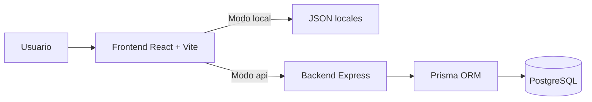
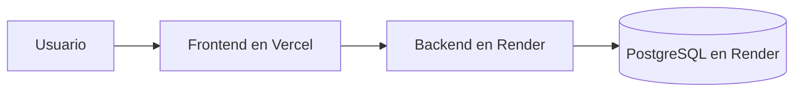

# SportMetric Academic

SportMetric Academic es una plataforma web académica orientada a la consulta guiada de protocolos de medición física y antropométrica. El proyecto evolucionó desde una SPA apoyada en archivos JSON locales hacia una arquitectura full stack desacoplada, con frontend en React, backend en Express y persistencia en PostgreSQL.

Este repositorio concentra la base técnica del sistema, la documentación de ingeniería y la preparación necesaria para una siguiente fase de integración real con formularios y persistencia de datos.

## Resumen ejecutivo

Hoy el proyecto ya permite:

- navegar categorías y protocolos desde el frontend;
- consultar esos datos desde archivos locales o desde la API;
- poblar PostgreSQL con un seed controlado;
- exponer endpoints de lectura estables para categorías y protocolos;
- desplegar frontend y backend por separado sin acoplar el código a un proveedor específico.

Todavía no implementa:

- persistencia de formularios;
- autenticación completa en frontend;
- panel administrativo;
- operaciones CRUD completas para gestión de contenido.

## Estado actual

| Componente | Estado | Descripción |
| --- | --- | --- |
| Frontend | Listo | Navegación, UI y consumo en modo `local` o `api`. |
| Backend | Listo | API Express + TypeScript + Prisma con endpoints de lectura. |
| Base de datos | Lista | PostgreSQL con migraciones y seed funcional. |
| Documentación | Completa | Guías de arquitectura, despliegue, base de datos, API, pruebas y diagramas. |
| Formularios | Pendiente | La estructura se dejó preparada, pero aún no se implementan. |

## Objetivo de esta etapa

Esta etapa se cerró con cuatro metas principales:

1. dejar una base técnica estable;
2. preparar el proyecto para despliegue desacoplado;
3. mantener portabilidad entre proveedores;
4. documentar el funcionamiento y la operación de forma clara.

## Arquitectura general



### Principios aplicados

- separación clara entre frontend, backend y base de datos;
- arquitectura por capas en backend;
- frontend desacoplado del origen de datos;
- configuración por variables de entorno;
- enfoque cloud agnostic para facilitar cambios futuros de infraestructura.

## Estructura del repositorio

```text
/
├── .github/
│   └── workflows/ci.yml
├── backend/
│   ├── prisma/
│   ├── src/
│   ├── .env.example
│   └── package.json
├── frontend/
│   ├── public/
│   ├── src/
│   ├── .env.example
│   └── package.json
├── shared/
│   └── constants/
├── docs/
├── docs-engineering/
│   ├── adr/
│   ├── api/
│   ├── architecture/
│   ├── database/
│   ├── deployment/
│   ├── testing/
│   └── diagrams/
├── docker/
├── README.md
├── README-backend.md
├── README-frontend.md
└── .gitignore
```

## Stack tecnológico

### Frontend

- React 19
- Vite
- React Router
- Tailwind CSS
- Framer Motion
- Lucide React
- Vitest

### Backend

- Node.js 22.x
- Express 5
- TypeScript
- Prisma 7
- PostgreSQL 16
- Pino
- Zod
- Swagger / OpenAPI
- Vitest + Supertest

## Cómo funciona el sistema hoy

El frontend puede operar de dos maneras:

### Modo `local`

Lee los archivos del propio proyecto:

- `frontend/src/data/categories.js`
- `frontend/src/data/protocols/*.json`

Este modo es útil para:

- revisión visual;
- validación rápida de contenido;
- trabajo sin depender del backend.

### Modo `api`

Consulta el backend mediante HTTP. En este caso, el backend obtiene la información desde PostgreSQL a través de Prisma.

Este modo es útil para:

- validar contratos reales entre frontend y backend;
- preparar despliegue productivo;
- avanzar hacia persistencia futura.

## Arranque rápido local

### 1. Requisitos

- Node.js 22.x
- npm 10+ u 11+
- PostgreSQL 16

### 2. Levantar el backend

Entrar a `backend/`, configurar el entorno y ejecutar:

```bash
npm install
npm run db:migrate:dev
npm run db:seed
npm run dev
```

Servicios locales del backend:

- API: `http://localhost:3001`
- Health check: `http://localhost:3001/api/health`
- Swagger: `http://localhost:3001/api/docs`

### 3. Levantar el frontend

Entrar a `frontend/` y ejecutar:

```bash
npm install
npm run dev
```

Aplicación local:

- Frontend: `http://localhost:5173`

### 4. Configuración mínima de variables

### Backend

Archivo base: `backend/.env.example`

Variables clave:

- `DATABASE_URL`
- `BACKEND_PUBLIC_URL`
- `FRONTEND_URL`
- `ALLOWED_ORIGINS`
- `JWT_SECRET`
- `JWT_REFRESH_SECRET`

### Frontend

Archivo base: `frontend/.env.example`

Variables clave:

- `VITE_DATA_SOURCE`
- `VITE_API_BASE_URL`

## Modos de operación del frontend

### Opción 1: seguir trabajando con datos locales

```env
VITE_DATA_SOURCE=local
```

### Opción 2: consumir la API local

```env
VITE_DATA_SOURCE=api
VITE_API_BASE_URL=http://localhost:3001
```

## Endpoints disponibles

### Salud

- `GET /api/health`

### Categorías

- `GET /api/categories`
- `GET /api/categories/:id`
- `GET /api/categories/:id/protocols`

### Protocolos

- `GET /api/protocols`
- `GET /api/protocols/:id`

## Despliegue recomendado

La estrategia más simple y coherente para este proyecto es:

- frontend en Vercel;
- backend en Render;
- PostgreSQL en Render.



Puntos importantes:

- el frontend no debe conectarse directamente a la base de datos;
- Render crea la instancia de PostgreSQL, pero las tablas las crean las migraciones de Prisma;
- el seed se ejecuta de forma controlada cuando se necesite poblar contenido base.

## Portabilidad futura

El proyecto quedó preparado para mover infraestructura sin reescribir la lógica principal:

- frontend a Vercel, Netlify o Render Static Site;
- backend a Render, Railway, Fly.io, AWS, Azure o GCP;
- PostgreSQL a Render, Neon, Supabase, Railway o RDS.

Esto es posible porque:

- la configuración depende de variables de entorno;
- Prisma centraliza el acceso a datos mediante `DATABASE_URL`;
- CORS se controla por configuración;
- el frontend solo necesita `VITE_API_BASE_URL` para cambiar de backend.

## Auditoría y pruebas

Antes de preparar commits o despliegues, conviene ejecutar esta validación mínima:

### Frontend

```bash
cd frontend
npm install
npm run test:run
npm run build
```

### Backend

```bash
cd backend
npm install
npm run test
npm run build
```

Estas pruebas validan:

- la capa de servicios del frontend;
- el contrato base del backend;
- rutas clave de consulta;
- respuesta estándar y manejo de errores principales.

## Troubleshooting rápido

### El backend no levanta

Revisar:

- `backend/.env`
- `DATABASE_URL`
- `JWT_SECRET`
- `JWT_REFRESH_SECRET`
- `ALLOWED_ORIGINS`

### Prisma no conecta a PostgreSQL

Verificar:

- que PostgreSQL esté activo;
- que el puerto sea correcto;
- que el usuario y la contraseña sean correctos;
- que exista la base `sportmetric`;
- que la `DATABASE_URL` esté bien formada.

### El frontend no carga datos desde la API

Verificar:

- `VITE_DATA_SOURCE=api`
- `VITE_API_BASE_URL`
- que el backend esté corriendo;
- que `ALLOWED_ORIGINS` incluya el origen del frontend.

### La base existe, pero no hay tablas

Ejecutar:

```bash
npm run db:migrate:dev
```

o en producción:

```bash
npm run db:migrate:deploy
```

### Hay tablas, pero no hay categorías ni protocolos

Ejecutar:

```bash
npm run db:seed
```

## Documentación técnica relacionada

- `README-backend.md`
- `README-frontend.md`
- `docs-engineering/architecture/arquitectura-general.md`
- `docs-engineering/api/estado-api.md`
- `docs-engineering/database/operacion-postgresql-prisma.md`
- `docs-engineering/deployment/render-vercel.md`
- `docs-engineering/testing/auditoria-y-pruebas.md`
- `docs-engineering/diagrams/indice-diagramas.md`
- `docs-engineering/adr/`

## Siguiente etapa prevista

La base quedó lista para pasar a una siguiente fase de implementación, pero se decidió posponerla hasta cerrar requerimientos funcionales:

- persistencia de formularios;
- definición exacta de campos;
- validaciones de negocio;
- flujo operativo real que necesite el equipo académico.
