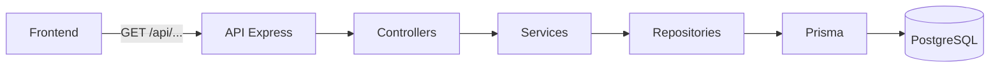

# Estado actual de la API

## Objetivo

Este documento resume qué expone hoy la API de SportMetric Academic, qué contratos ya están estabilizados y qué parte queda pendiente para fases futuras.

## Base URL local

- `http://localhost:3001`

## Vista general de consumo



## Convención de respuesta exitosa

Las respuestas exitosas siguen esta estructura:

```json
{
  "success": true,
  "data": {},
  "message": "Mensaje descriptivo"
}
```

## Convención de error

Las respuestas de error siguen esta estructura:

```json
{
  "success": false,
  "error": {
    "code": "ERROR_CODE",
    "message": "Mensaje legible"
  }
}
```

## Endpoints disponibles

### Salud

- `GET /api/health`

Sirve para verificar que la API está levantada y respondiendo.

### Categorías

- `GET /api/categories`
- `GET /api/categories/:id`
- `GET /api/categories/:id/protocols`

Permiten listar categorías, consultar una categoría puntual y listar los protocolos pertenecientes a una categoría.

### Protocolos

- `GET /api/protocols`
- `GET /api/protocols/:id`

Permiten listar protocolos en formato resumido y consultar el detalle completo de un protocolo.

## Mapa actual de endpoints

```mermaid
flowchart TD
    API[API /api] --> Health[/health]
    API --> Categories[/categories]
    API --> Protocols[/protocols]

    Categories --> CategoriesList[GET /api/categories]
    Categories --> CategoryById[GET /api/categories/:id]
    Categories --> CategoryProtocols[GET /api/categories/:id/protocols]

    Protocols --> ProtocolsList[GET /api/protocols]
    Protocols --> ProtocolById[GET /api/protocols/:id]
```

## Fuente de datos actual

Hoy la API lee desde PostgreSQL a través de Prisma. La base se alimenta mediante:

- `frontend/src/data/categories.json`
- `frontend/src/data/protocols/*.json`
- `backend/prisma/seed.ts`

Esto garantiza una transición controlada entre el contenido histórico en JSON y la base relacional.

## Estado de madurez

### Ya estable

- health check;
- consulta de categorías;
- consulta de protocolos;
- detalle completo de protocolos;
- seed inicial para poblar la base;
- CORS configurable por variables de entorno.

### Preparado para la siguiente fase

- autenticación;
- persistencia de formularios;
- endpoints de escritura;
- panel administrativo;
- versionado más formal del contrato.

## Códigos de error relevantes

- `CATEGORY_NOT_FOUND`
- `PROTOCOL_NOT_FOUND`
- `VALIDATION_ERROR`
- `UNIQUE_CONSTRAINT`
- `NOT_FOUND`
- `DATABASE_ERROR`
- `INTERNAL_ERROR`

## Observaciones de diseño

- El frontend no accede a PostgreSQL directamente.
- La API es la única responsable de exponer datos al cliente.
- El contrato de lectura ya quedó suficientemente desacoplado para cambiar de proveedor de hosting sin reescribir la lógica de dominio.

## Flujo de respuesta estándar


