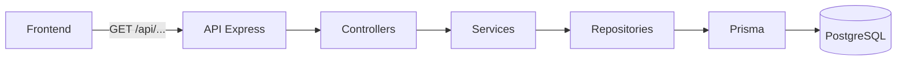
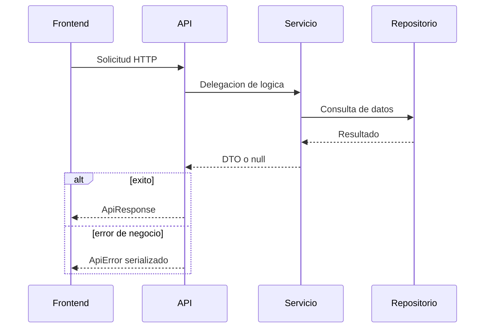

# Estado actual de la API

## Objetivo

Este documento resume que expone hoy la API de SportMetric Academic, que contratos ya estan estabilizados y que parte queda pendiente para fases futuras.

## Base URL local

- `http://localhost:3001`

## Estado real verificado

La API fue validada recientemente con:

- `lint`;
- pruebas automatizadas con cobertura;
- build compilado;
- ejecucion real de `npm start`;
- consultas HTTP manuales a endpoints principales.

Endpoints comprobados en runtime:

- `GET /api/health`
- `GET /api/categories`
- `GET /api/protocols/:id`

## Vista general de consumo



## Convencion de respuesta exitosa

Las respuestas exitosas siguen esta estructura:

```json
{
  "success": true,
  "data": {},
  "message": "Mensaje descriptivo"
}
```

## Convencion de error

Las respuestas de error siguen esta estructura:

```json
{
  "success": false,
  "error": {
    "code": "ERROR_CODE",
    "message": "Mensaje legible"
  }
}
```

## Endpoints disponibles

### Salud

- `GET /api/health`

Sirve para verificar que la API esta levantada y respondiendo.

### Categorias

- `GET /api/categories`
- `GET /api/categories/:id`
- `GET /api/categories/:id/protocols`

Permiten listar categorias, consultar una categoria puntual y listar los protocolos pertenecientes a una categoria.

### Protocolos

- `GET /api/protocols`
- `GET /api/protocols/:id`

Permiten listar protocolos en formato resumido y consultar el detalle completo de un protocolo.

## Mapa actual de endpoints

```mermaid
flowchart TD
    API[API /api] --> Health[/health]
    API --> Categories[/categories]
    API --> Protocols[/protocols]

    Categories --> CategoriesList[GET /api/categories]
    Categories --> CategoryById[GET /api/categories/:id]
    Categories --> CategoryProtocols[GET /api/categories/:id/protocols]

    Protocols --> ProtocolsList[GET /api/protocols]
    Protocols --> ProtocolById[GET /api/protocols/:id]
```

## Fuente de datos actual

Hoy la API lee desde PostgreSQL a traves de Prisma. La base se alimenta mediante:

- `frontend/src/data/categories.js`
- `frontend/src/data/protocols/*.json`
- `backend/prisma/seed.ts`

Esto garantiza una transicion controlada entre el contenido historico local y la base relacional.

## Estado de madurez

### Ya estable

- health check;
- consulta de categorias;
- consulta de protocolos;
- detalle completo de protocolos;
- seed inicial para poblar la base;
- CORS configurable por variables de entorno;
- runtime compilado funcional mediante copia del cliente Prisma a `dist/generated/prisma`.

### Preparado para la siguiente fase

- autenticacion;
- persistencia de formularios;
- endpoints de escritura;
- panel administrativo;
- versionado mas formal del contrato.

## Codigos de error relevantes

- `CATEGORY_NOT_FOUND`
- `PROTOCOL_NOT_FOUND`
- `VALIDATION_ERROR`
- `UNIQUE_CONSTRAINT`
- `NOT_FOUND`
- `DATABASE_ERROR`
- `INTERNAL_ERROR`

## Observaciones de diseno

- El frontend no accede a PostgreSQL directamente.
- La API es la unica responsable de exponer datos al cliente.
- El contrato de lectura ya quedo suficientemente desacoplado para cambiar de proveedor de hosting sin reescribir la logica de dominio.
- El build del backend ya no depende de placeholders de Prisma al ejecutar `npm start`.

## Flujo de respuesta estandar


