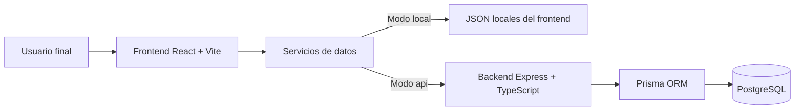
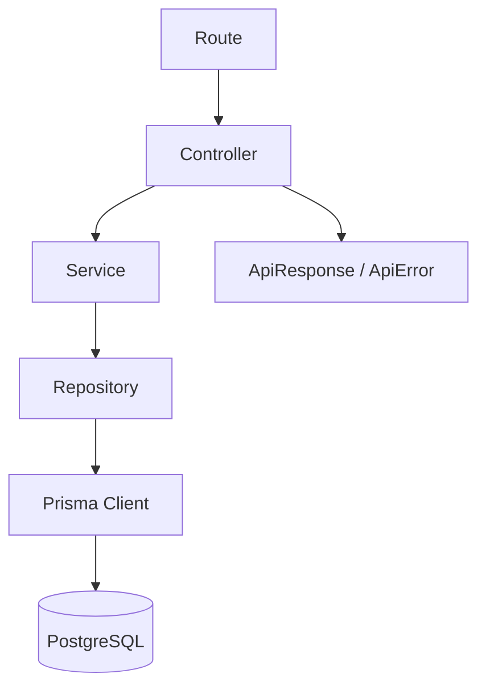
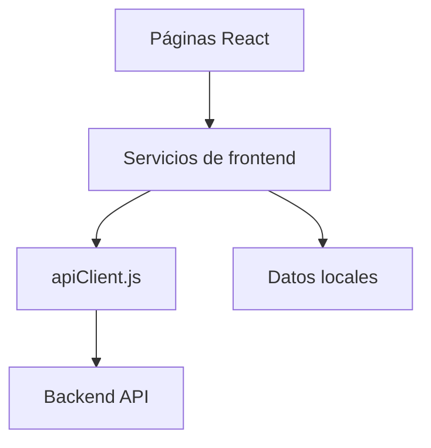
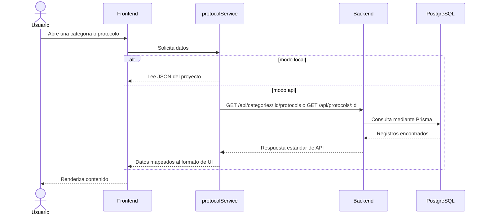

# Arquitectura general de SportMetric Academic

## Objetivo

Este documento describe la arquitectura actual del proyecto, las responsabilidades principales de cada capa y la forma en que el sistema quedó preparado para crecer sin sobreingeniería.

## Vista general del sistema

## Componentes principales

### Frontend

Responsable de:

- navegación entre pantallas;
- renderizado de categorías y protocolos;
- cambio entre fuente local y API;
- presentación visual y experiencia de usuario.

### Backend

Responsable de:

- exponer la API REST;
- aplicar reglas de negocio mínimas;
- centralizar acceso a datos;
- aislar al frontend de la base de datos.

### Base de datos

Responsable de:

- persistir categorías y protocolos;
- servir como fuente única de verdad cuando el frontend opere en modo `api`;
- soportar el crecimiento futuro hacia formularios, autenticación y panel administrativo.

## Arquitectura interna del backend

## Arquitectura interna del frontend

## Flujo de lectura de protocolos

## Decisiones estructurales clave

- monorepo simple en lugar de una estructura más pesada;
- frontend desacoplado del backend;
- PostgreSQL como base relacional estándar;
- Prisma como capa de acceso portable;
- variables de entorno para aislar infraestructura del código.

## Preparación para fases futuras

La arquitectura ya quedó lista para incorporar:

- persistencia de formularios;
- autenticación;
- endpoints de escritura;
- edición administrativa;
- cambio de proveedor de infraestructura sin rediseño profundo.
