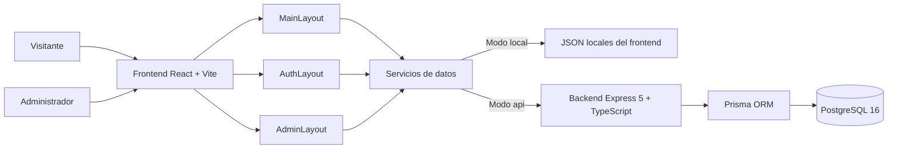
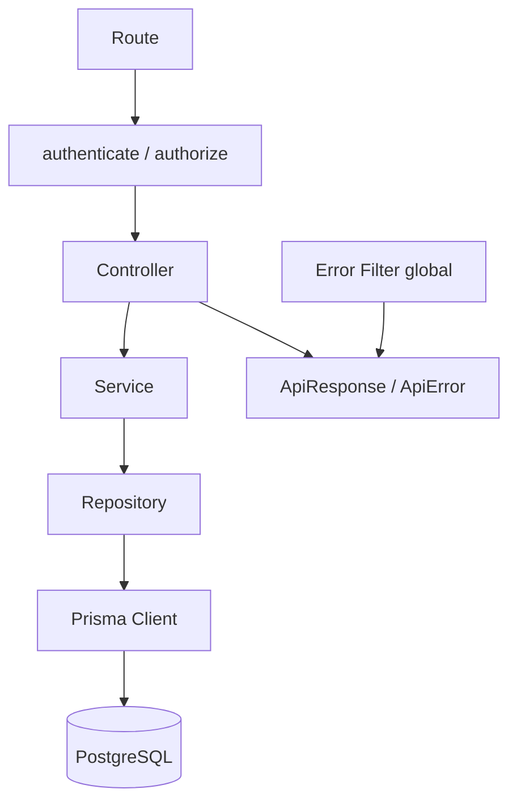
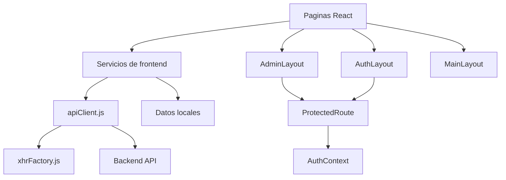
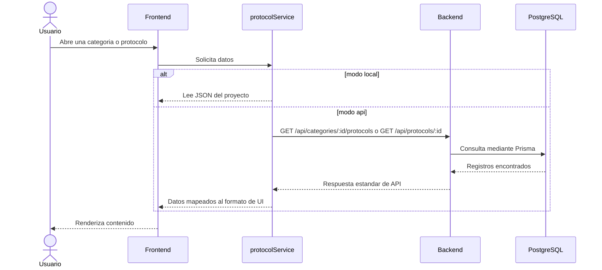
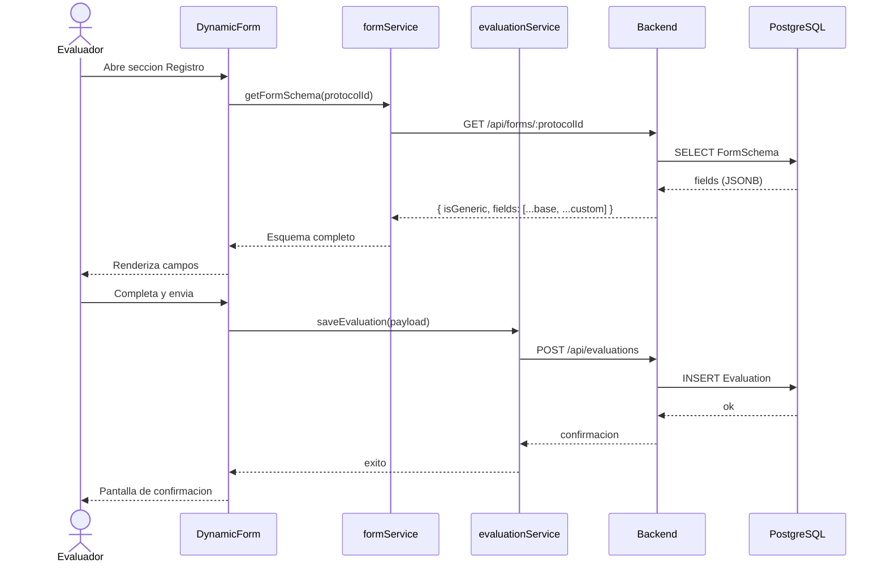

# Arquitectura general de SportMetric Academic

## Objetivo

Este documento describe la arquitectura actual del proyecto, las responsabilidades principales de cada capa y la forma en que el sistema quedo preparado para crecer sin sobreingenieria.

## Vista general del sistema

```mermaid
flowchart LR
    Visitante[Visitante] --> Frontend[Frontend React + Vite]
    Admin[Administrador] --> Frontend
    Frontend --> AuthLayout[AuthLayout]
    Frontend --> MainLayout[MainLayout]
    Frontend --> AdminLayout[AdminLayout]
    MainLayout --> Servicios[Servicios de datos]
    AuthLayout --> Servicios
    AdminLayout --> Servicios
    Servicios -->|Modo local| Json[JSON locales del frontend]
    Servicios -->|Modo api| Backend[Backend Express 5 + TypeScript]
    Backend --> Prisma[Prisma ORM]
    Prisma --> PostgreSQL[(PostgreSQL 16)]
```

## Componentes principales

### Frontend

Responsable de:

- navegacion entre pantallas (publica, autenticacion y admin);
- renderizado de categorias, protocolos y formularios dinamicos;
- cambio entre fuente local y API;
- gestion de sesion (access + refresh tokens);
- presentacion visual, transiciones y experiencia de usuario;
- cache busting en endpoints dinamicos;
- cliente HTTP basado en XMLHttpRequest (inyectable).

### Backend

Responsable de:

- exponer la API REST versionada bajo `/api`;
- aplicar reglas de negocio y validaciones;
- autenticar con JWT, refresh tokens y Argon2;
- autorizar por rol (ADMIN);
- centralizar acceso a datos con Prisma;
- persistir esquemas dinamicos (FormSchema) como JSONB;
- servir resumenes y metricas para el dashboard.

### Base de datos

Responsable de:

- persistir categorias, protocolos (con relaciones 1:N) y esquemas de formulario;
- registrar evaluaciones con resultados en JSONB;
- gestionar usuarios, roles y tokens de recuperacion;
- servir como fuente unica de verdad cuando el frontend opera en modo `api`.

## Arquitectura interna del backend

```mermaid
flowchart TD
    Ruta[Route] --> Middleware[authenticate / authorize]
    Middleware --> Controlador[Controller]
    Controlador --> Servicio[Service]
    Servicio --> Repositorio[Repository]
    Repositorio --> Prisma[Prisma Client]
    Prisma --> BD[(PostgreSQL)]
    Controlador --> Respuesta[ApiResponse / ApiError]
    ErrorFilter[Error Filter global] --> Respuesta
```

Cada modulo (`auth`, `users`, `categories`, `protocols`, `forms`, `evaluations`, `analytics`) replica este patron.

## Arquitectura interna del frontend

```mermaid
flowchart TD
    Paginas[Paginas React] --> Servicios[Servicios de frontend]
    Servicios --> ApiClient[apiClient.js]
    ApiClient --> XhrFactory[xhrFactory.js]
    ApiClient --> Backend[Backend API]
    Servicios --> LocalData[Datos locales]
    Paginas --> AdminLayout
    Paginas --> AuthLayout
    Paginas --> MainLayout
    AdminLayout --> ProtectedRoute
    AuthLayout --> ProtectedRoute
    ProtectedRoute --> AuthContext
```

## Flujo de lectura de protocolos

```mermaid
sequenceDiagram
    actor U as Usuario
    participant F as Frontend
    participant S as protocolService
    participant B as Backend
    participant D as PostgreSQL

    U->>F: Abre una categoria o protocolo
    F->>S: Solicita datos
    alt modo local
        S-->>F: Lee JSON del proyecto
    else modo api
        S->>B: GET /api/categories/:id/protocols o GET /api/protocols/:id
        B->>D: Consulta mediante Prisma
        D-->>B: Registros encontrados
        B-->>S: Respuesta estandar de API
        S-->>F: Datos mapeados al formato de UI
    end
    F-->>U: Renderiza contenido
```

## Flujo de captura de evaluacion

```mermaid
sequenceDiagram
    actor U as Evaluador
    participant F as DynamicForm
    participant FS as formService
    participant ES as evaluationService
    participant B as Backend
    participant D as PostgreSQL

    U->>F: Abre seccion Registro
    F->>FS: getFormSchema(protocolId)
    FS->>B: GET /api/forms/:protocolId
    B->>D: SELECT FormSchema
    D-->>B: fields (JSONB)
    B-->>FS: { isGeneric, fields: [...base, ...custom] }
    FS-->>F: Esquema completo
    F-->>U: Renderiza campos
    U->>F: Completa y envia
    F->>ES: saveEvaluation(payload)
    ES->>B: POST /api/evaluations
    B->>D: INSERT Evaluation
    D-->>B: ok
    B-->>ES: confirmacion
    ES-->>F: exito
    F-->>U: Pantalla de confirmacion
```

## Decisiones estructurales clave

- monorepo simple en lugar de una estructura mas pesada;
- frontend desacoplado del backend;
- PostgreSQL como base relacional estandar;
- Prisma como capa de acceso portable;
- variables de entorno para aislar infraestructura del codigo;
- JSONB para campos personalizables (sin refactor por cambios academicos);
- Argon2 + JWT para autenticacion robusta;
- Cloud-agnostic: cambio de proveedor solo requiere ajustar `.env`.

## Preparacion para fases futuras

La arquitectura ya quedo lista para incorporar:

- internacionalizacion;
- reportes y exportacion masiva;
- notificaciones;
- integracion con sistemas externos (LMS, ERP);
- versionado y publicacion del API.
