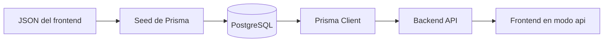
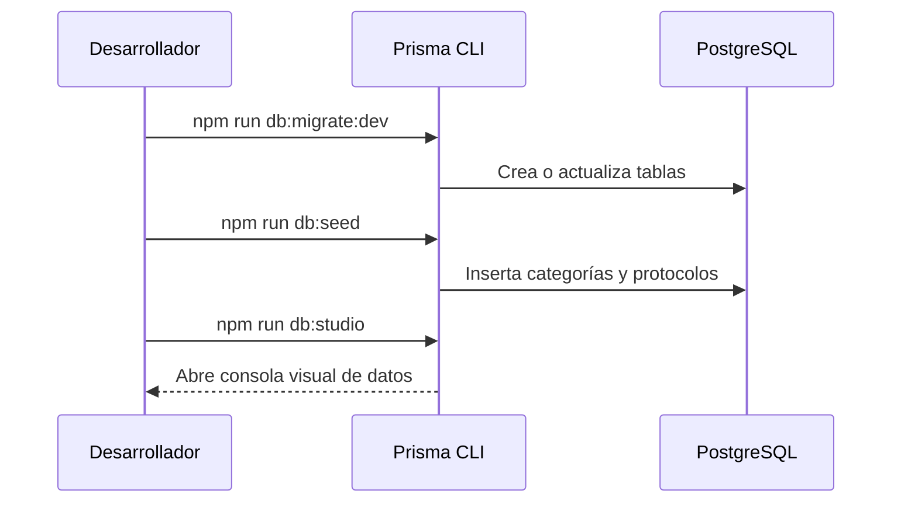
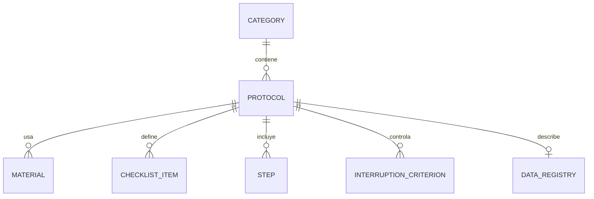

# Operación de PostgreSQL y Prisma

## Base local de desarrollo

- motor: PostgreSQL 16
- puerto: `5432`
- base local: `sportmetric`

## Vista general de datos



## Flujo básico



### Crear o actualizar tablas en desarrollo

```bash
npm run db:migrate:dev
```

### Aplicar migraciones en producción

```bash
npm run db:migrate:deploy
```

### Poblar categorías y protocolos

```bash
npm run db:seed
```

### Abrir Prisma Studio

```bash
npm run db:studio
```

## Fuente de datos del seed

El seed toma información desde:

- `frontend/src/data/categories.json`
- `frontend/src/data/protocols/*.json`

Esto permite mantener un contenido base coherente mientras el frontend termina de migrar a consumo 100% por API.

## Relación lógica principal de entidades



## Problemas comunes

### La base existe pero no hay tablas

Causa probable:

- no se ejecutaron las migraciones.

Solución:

```bash
npm run db:migrate:dev
```

### Las tablas existen pero no hay categorías ni protocolos

Causa probable:

- no se ejecutó el seed;
- el seed falló a mitad del proceso.

Solución:

```bash
npm run db:seed
```

### Prisma no conecta

Revisar:

- `DATABASE_URL`
- usuario y contraseña
- puerto
- nombre de la base
- servicio PostgreSQL levantado

### El backend compila pero falla en producción

Revisar:

- que el proveedor tenga `DATABASE_URL` configurada;
- que `npm run db:migrate:deploy` se esté ejecutando;
- que el Prisma Client se genere durante el build.
