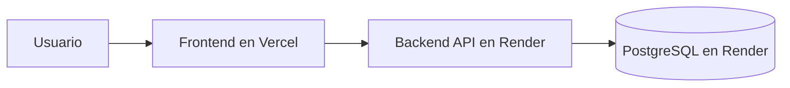
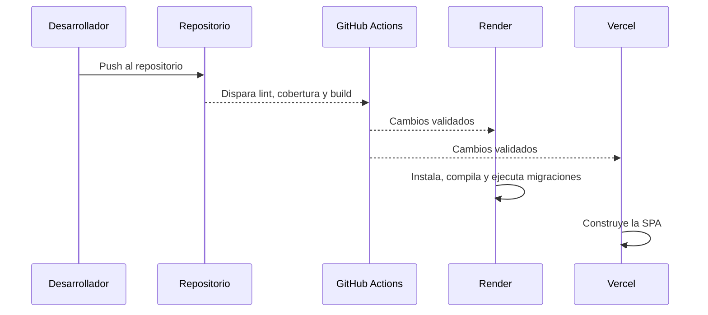
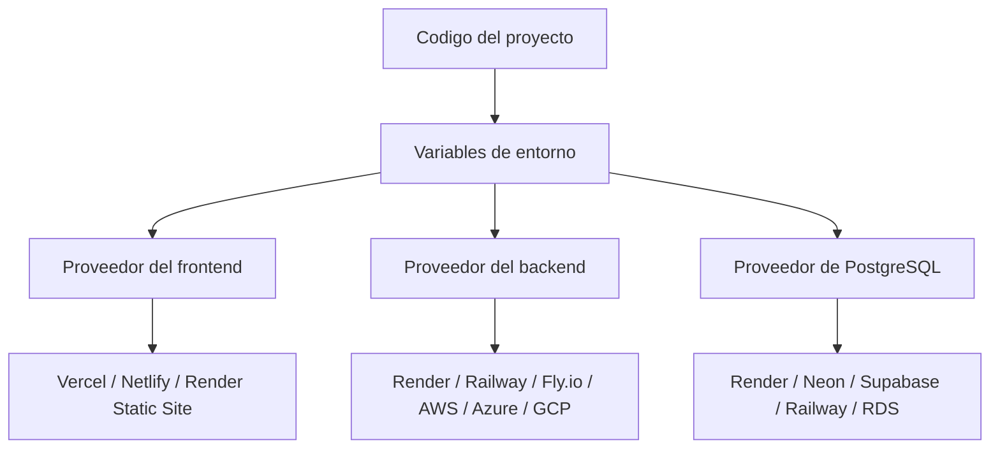

# Despliegue recomendado: Vercel + Render

## Objetivo

Desplegar:

- frontend en Vercel;
- backend en Render;
- PostgreSQL en Render.

## Arquitectura final

## Estado actual del despliegue

La configuracion del monorepo ya quedo alineada con el estado real del proyecto:

- Vercel construye el frontend desde la raiz usando `vercel.json`;
- el backend ya pasa `npm ci`, `lint`, `test:coverage` y `build`;
- el build del backend copia el cliente Prisma generado a `dist/generated/prisma`, necesario para que `npm start` funcione en runtime;
- GitHub Actions valida frontend y backend antes de despliegues posteriores.

## 1. Crear la base de datos en Render

1. Crear un servicio PostgreSQL.
2. Guardar la `DATABASE_URL` que entrega Render.
3. No hace falta abrir consola todavia.

Importante:

- Render crea la instancia de base de datos;
- Prisma crea las tablas;
- el seed carga los datos iniciales cuando se necesite.

## 2. Crear el backend en Render

Configuracion recomendada:

- Service Type: Web Service
- Root Directory: `backend`
- Build Command: `npm install && npm run deploy:render`
- Start Command: `npm run start`

Variables de entorno:

- `NODE_ENV=production`
- `PORT=10000` o el puerto que Render gestione internamente
- `BACKEND_PUBLIC_URL=https://tu-backend.onrender.com`
- `DATABASE_URL=...`
- `JWT_SECRET=...`
- `JWT_REFRESH_SECRET=...`
- `FRONTEND_URL=https://tu-frontend.vercel.app`
- `ALLOWED_ORIGINS=https://tu-frontend.vercel.app`

Notas:

- `deploy:render` compila y aplica migraciones;
- el seed no tiene por que correr en cada deploy;
- si necesitas poblar datos iniciales, ejecutalo una vez de forma controlada;
- `npm run build` ya incluye la copia del cliente Prisma a `dist/`, asi que no hace falta un paso extra manual.

## 3. Crear el frontend en Vercel

Configuracion recomendada:

- Framework: Vite
- Root Directory: `frontend` si configuras el proyecto dentro de esa carpeta, o raiz del repo usando `vercel.json`

Variables:

- `VITE_DATA_SOURCE=api`
- `VITE_API_BASE_URL=https://tu-backend.onrender.com`

Nota:

- si despliegas desde la raiz del monorepo, mantener `vercel.json` evita que Vercel intente construir el proyecto equivocado.

## 4. Flujo de cambios normales

Despues del primer setup, el flujo esperado es:

1. hacer push al repositorio;
2. GitHub Actions valida frontend y backend;
3. Render redepliega backend;
4. Vercel redepliega frontend.

## 5. Cuando si hace falta intervencion manual

- cuando quieres correr el seed por primera vez;
- cuando necesitas corregir datos manualmente;
- cuando cambias secretos o URLs;
- cuando agregas nuevas migraciones.

## 6. Cambio futuro de proveedor

La solucion quedo preparada para poder mover:

- frontend a Netlify, Render Static Site o similar;
- backend a Railway, Fly.io, AWS, Azure o GCP;
- PostgreSQL a Neon, Supabase, Railway o RDS.

La clave es mantener:

- `DATABASE_URL`;
- `BACKEND_PUBLIC_URL`;
- `ALLOWED_ORIGINS`;
- `VITE_API_BASE_URL`.

## Diagrama de portabilidad

