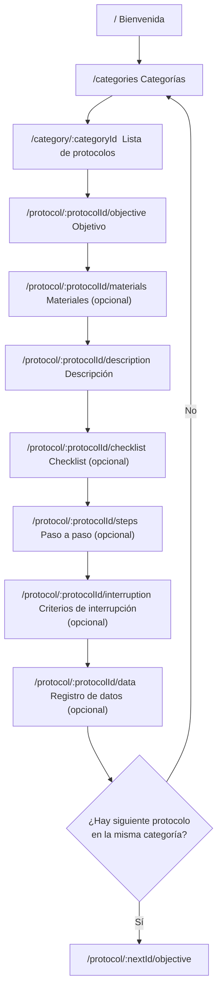

## Flujo oficial de la app (SportMetric Academic)

Esta app es data-driven: el contenido de cada protocolo se renderiza desde JSON en `src/data/protocols/*.json`.

### Rutas principales

- `/` Bienvenida
- `/categories` Categorías
- `/category/:categoryId` Lista de protocolos (filtrada por categoría o `all`)
- `/protocol/:protocolId/*` Detalle del protocolo (secciones internas)

### Diagrama (Mermaid)

### Reglas de navegación por secciones

- La pantalla de detalle construye dinámicamente el listado de secciones según el JSON:
  - Siempre: Objetivo y Descripción.
  - Solo si hay contenido:
    - `materials.length > 0`
    - `checklist.length > 0`
    - `steps.length > 0`
    - `interruptionCriteria.length > 0`
    - `dataRegistry` con al menos una clave.
- El flujo de secciones está definido de forma declarativa en el contenedor del protocolo y se filtra por `enabled(protocol)` para mejorar mantenibilidad.
- La navegación “Siguiente/Anterior” está en el contenedor del protocolo para evitar pantallas sin salida.
- En la última sección:
  - Si existe un siguiente protocolo dentro de la misma categoría, navega a ese protocolo.
  - Si no, vuelve a Categorías.
