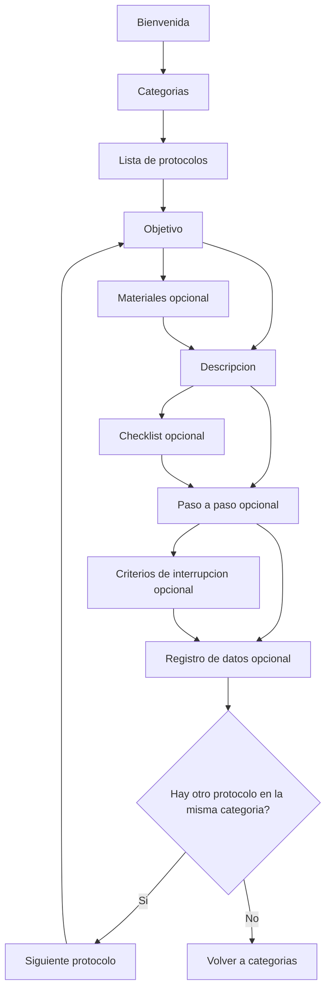

## Flujo oficial de la app (SportMetric Academic)

Esta app está basada en datos: el contenido de cada protocolo se carga desde archivos JSON ubicados en `src/data/protocols/*.json`.

### Rutas principales

- `/` Bienvenida
- `/categories` Categorías
- `/category/:categoryId` Lista de protocolos, filtrada por categoría o `all`
- `/protocol/:protocolId/*` Detalle del protocolo con sus secciones internas

### Diagrama del flujo

### Reglas de navegación por secciones

- La pantalla de detalle construye dinámicamente la lista de secciones según el JSON del protocolo.
- Siempre se muestran las secciones `Objetivo` y `Descripción`.
- Solo se muestran si tienen contenido:
  - `materials.length > 0`
  - `checklist.length > 0`
  - `steps.length > 0`
  - `interruptionCriteria.length > 0`
  - `dataRegistry` con al menos una clave
- El flujo de secciones está definido de forma declarativa en el contenedor del protocolo y se filtra con `enabled(protocol)` para facilitar el mantenimiento.
- La navegación global `Anterior` y `Siguiente` vive en el contenedor del protocolo para evitar pantallas sin salida.
- Si el usuario está en la primera sección y pulsa `Anterior`, vuelve a la lista de protocolos de la categoría actual.
- En la última sección:
  - Si existe un siguiente protocolo dentro de la misma categoría, la app navega a ese protocolo.
  - Si no existe, la app vuelve a `Categorías`.
- Como apoyo adicional de accesibilidad, también se muestra una acción secundaria para volver directamente a `Categorías`.
