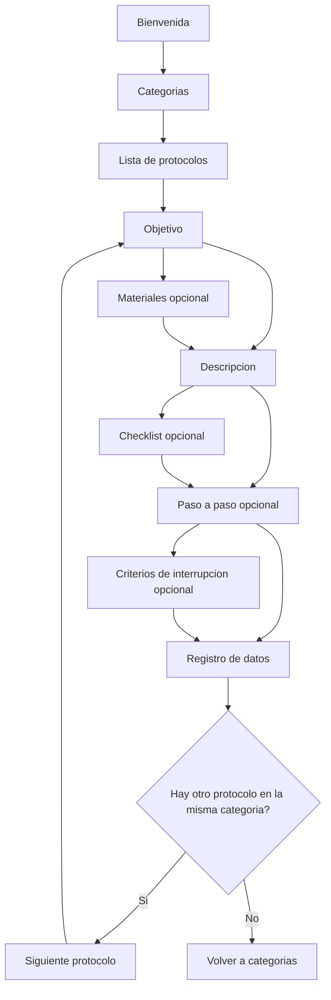
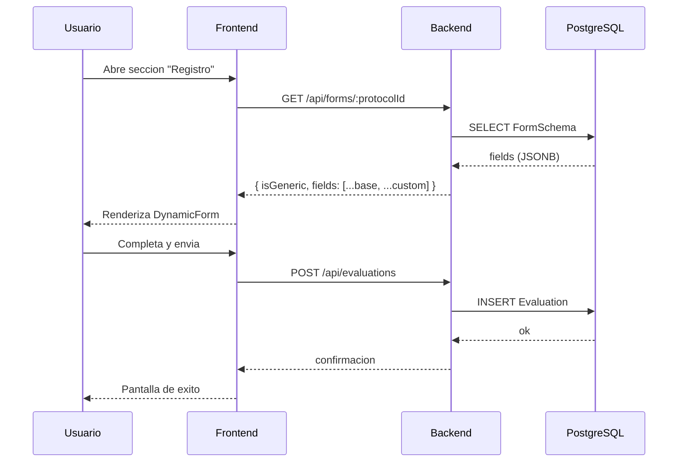
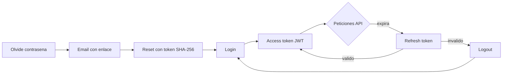
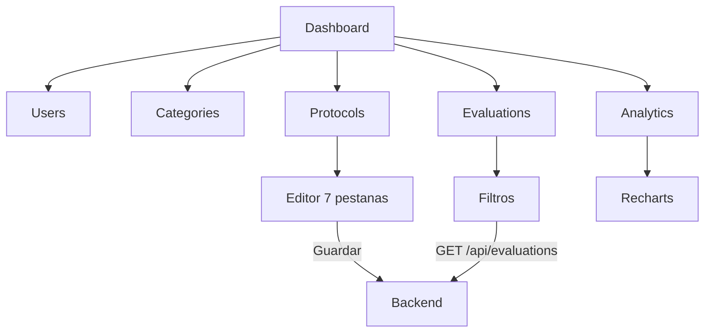
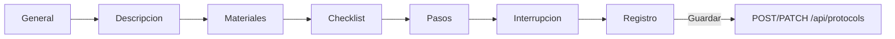
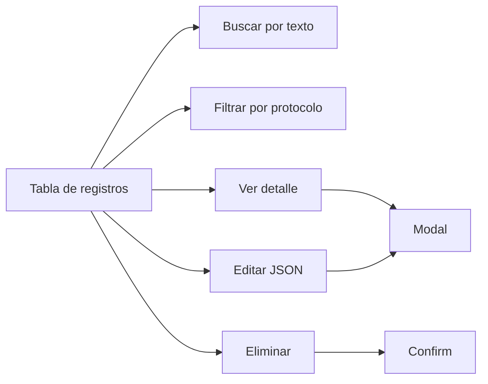
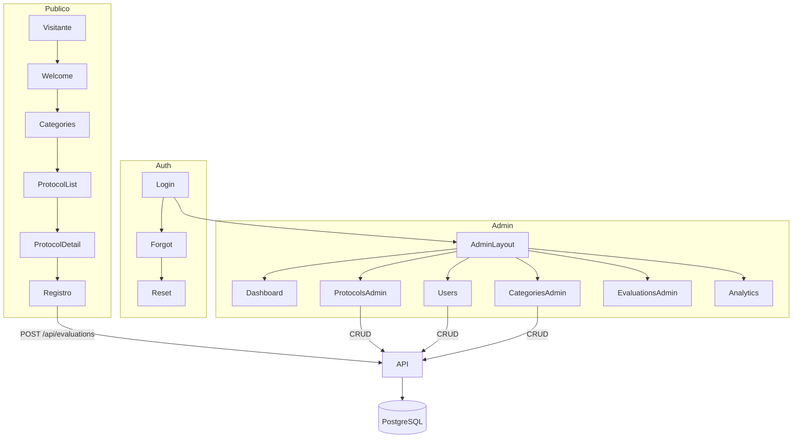

# Flujo oficial de la app (SportMetric Academic)

SportMetric Academic combina tres tipos de flujo:

1. flujo publico de consulta (visitantes y evaluadores);
2. flujo de autenticacion y recuperacion;
3. flujo administrativo (panel `/admin` con CRUDs y analiticas).

Todos los datos se persisten en PostgreSQL mediante Prisma. La aplicacion puede trabajar en modo `api` (consulta al backend) o `local` (lectura desde JSON) segun la variable `VITE_DATA_SOURCE`.

---

## 1. Flujo publico (visitante / evaluador)

### Rutas

- `/` Bienvenida
- `/categories` Categorias
- `/category/:categoryId` Lista de protocolos filtrada por categoria (o `all`)
- `/protocol/:protocolId/*` Detalle del protocolo con sus secciones internas

### Diagrama del flujo de lectura


```mermaid
flowchart TD
  A["Bienvenida"] --> B["Categorias"]
  B --> C["Lista de protocolos"]
  C --> D["Objetivo"]
  D --> E["Materiales opcional"]
  D --> F["Descripcion"]
  E --> F
  F --> G["Checklist opcional"]
  F --> H["Paso a paso opcional"]
  G --> H
  H --> I["Criterios de interrupcion opcional"]
  H --> J["Registro de datos"]
  I --> J
  J --> K{"Hay otro protocolo en la misma categoria?"}
  K -->|Si| L["Siguiente protocolo"]
  K -->|No| M["Volver a categorias"]
  L --> D
```

### Reglas de visualizacion

- La pantalla de detalle construye dinamicamente la lista de secciones segun el protocolo persistido.
- Siempre se muestran las secciones `Objetivo` y `Descripcion`.
- Solo se muestran si tienen contenido:
  - `materials.length > 0`
  - `checklistItems.length > 0`
  - `steps.length > 0`
  - `interruptionCrit.length > 0`
  - `dataRegistry` con al menos una clave
- La navegacion global `Anterior` y `Siguiente` vive en el contenedor del protocolo.
- Si el usuario esta en la primera seccion y pulsa `Anterior`, vuelve a la lista de protocolos de la categoria actual.
- En la ultima seccion:
  - Si existe un siguiente protocolo dentro de la misma categoria, navega a ese protocolo.
  - Si no, vuelve a `Categorias`.

### Seccion Registro de datos

La seccion final del protocolo muestra el `DynamicForm` generado a partir del esquema devuelto por `GET /api/forms/:protocolId`. El esquema siempre incluye los 3 campos base (`id_estudiante`, `evaluado`, `evaluador`) mas los campos personalizados del admin.


```mermaid
sequenceDiagram
    participant U as Usuario
    participant F as Frontend
    participant B as Backend
    participant DB as PostgreSQL

    U->>F: Abre seccion "Registro"
    F->>B: GET /api/forms/:protocolId
    B->>DB: SELECT FormSchema
    DB-->>B: fields (JSONB)
    B-->>F: { isGeneric, fields: [...base, ...custom] }
    F-->>U: Renderiza DynamicForm
    U->>F: Completa y envia
    F->>B: POST /api/evaluations
    B->>DB: INSERT Evaluation
    DB-->>B: ok
    B-->>F: confirmacion
    F-->>U: Pantalla de exito
```

---

## 2. Flujo de autenticacion

### Diagrama general


```mermaid
flowchart LR
  A[Login] --> B[Access token JWT]
  B --> C{Peticiones API}
  C -->|expira| D[Refresh token]
  D -->|valido| B
  D -->|invalido| E[Logout]
  E --> A
  F[Olvide contrasena] --> G[Email con enlace]
  G --> H[Reset con token SHA-256]
  H --> A
```

### Rutas

- `/login` Formulario de ingreso.
- `/forgot-password` Solicitud de recuperacion.
- `/reset-password?token=...` Formulario de nueva contrasena.

### Endpoints involucrados

- `POST /api/auth/login` (valida con Argon2, emite access + refresh).
- `POST /api/auth/refresh` (rota el refresh token, emite uno nuevo).
- `POST /api/auth/logout` (invalida el refresh token en BD).
- `POST /api/auth/forgot-password` (genera token SHA-256 con TTL de 1h).
- `POST /api/auth/reset-password` (consume token y actualiza hash con Argon2).

### Detalles de seguridad

- Argon2 como algoritmo de hashing (parametrizado para workstation).
- Tokens de recuperacion: 32 bytes aleatorios, hash SHA-256 en BD, expiracion de 1 hora, un solo uso.
- Access token: JWT firmado con `JWT_SECRET`, expiracion corta.
- Refresh token: JWT firmado con `JWT_REFRESH_SECRET`, persistido como hash en BD, rotacion automatica.
- Middleware `authenticate` extrae el Bearer token y carga el usuario.
- Middleware `authorize('ADMIN')` valida el rol antes de llegar al controlador.
- Helmet con CSP estricta + CORS configurable por `ALLOWED_ORIGINS`.
- Rate limit por IP (configurable, `generalLimiter` elevado a 1000/15min para uso admin intensivo).

---

## 3. Flujo administrativo (`/admin`)

Acceso protegido por `ProtectedRoute` + `authenticate` + `authorize('ADMIN')`.

### Diagrama de modulos


```mermaid
flowchart TD
  Dashboard --> Users
  Dashboard --> Categories
  Dashboard --> Protocols
  Dashboard --> Evaluations
  Dashboard --> Analytics
  Protocols --> Editor["Editor 7 pestanas"]
  Editor -->|Guardar| Backend
  Evaluations --> Filtros
  Filtros -->|GET /api/evaluations| Backend
  Analytics --> Recharts
```

### Rutas admin

- `/admin` Dashboard con resumen y KPIs.
- `/admin/users` CRUD de usuarios.
- `/admin/categories` CRUD de categorias con color picker libre.
- `/admin/protocols` Listado de protocolos.
- `/admin/protocols/:id` Editor del protocolo (7 pestanas).
- `/admin/protocols/new` Crear protocolo nuevo.
- `/admin/evaluations` Listado de evaluaciones con filtros.
- `/admin/analytics` Estadisticas con graficos Recharts.

### Editor de Protocolos (7 pestanas)


```mermaid
flowchart LR
  T1[General] --> T2[Descripcion]
  T2 --> T3[Materiales]
  T3 --> T4[Checklist]
  T4 --> T5[Pasos]
  T5 --> T6[Interrupcion]
  T6 --> T7[Registro]
  T7 -->|Guardar| Save[POST/PATCH /api/protocols]
```

| Pestana | Campos |
| --- | --- |
| General | id (slug), titulo, categoria |
| Descripcion | descripcion larga |
| Materiales | name + image (ordenados) |
| Checklist | text (ordenado) |
| Pasos | step, title, description, video (ordenado) |
| Interrupcion | text (ordenado) |
| Registro | campos personalizados del FormSchema |

El guardado se hace en una sola transaccion Prisma (`prisma.$transaction`) que:

- Crea/actualiza el `Protocol`.
- Hace `upsert` de las relaciones 1:N (Material, ChecklistItem, Step, InterruptionCriterion, DataRegistry).
- Hace `upsert` del `FormSchema` 1:1.

### Gestion de Evaluaciones


```mermaid
flowchart LR
  A[Tabla de registros] --> B[Buscar por texto]
  A --> C[Filtrar por protocolo]
  A --> D[Ver detalle]
  A --> E[Editar JSON]
  A --> F[Eliminar]
  D --> Modal
  E --> Modal
  F --> Confirm
```

### Estadisticas (Recharts)

- Tarjetas de resumen: total de usuarios, protocolos, evaluaciones y actividad reciente.
- Grafico de linea: evaluaciones por dia.
- Grafico de barras: top 5 protocolos mas evaluados.
- Grafico circular: distribucion por categoria.
- Boton de exportacion a CSV.

---

## 4. Diagrama unificado de la aplicacion


```mermaid
flowchart TB
  subgraph Publico
    V[Visitante] --> Welcome
    Welcome --> Categories
    Categories --> ProtocolList
    ProtocolList --> ProtocolDetail
    ProtocolDetail --> Registro
  end
  subgraph Auth
    Login --> Forgot
    Forgot --> Reset
  end
  subgraph Admin
    Login --> AdminLayout
    AdminLayout --> Dashboard
    AdminLayout --> Users
    AdminLayout --> CategoriesAdmin
    AdminLayout --> ProtocolsAdmin
    AdminLayout --> EvaluationsAdmin
    AdminLayout --> Analytics
  end
  Registro -->|POST /api/evaluations| API
  ProtocolsAdmin -->|CRUD| API
  Users -->|CRUD| API
  CategoriesAdmin -->|CRUD| API
  API --> DB[(PostgreSQL)]
```

---

## 5. Modos de operacion

### Modo `local`

El frontend lee desde `frontend/src/data/*.js` y `frontend/src/data/protocols/*.json`. Util para diseno visual y revision academica sin levantar el backend.

### Modo `api`

El frontend consume la API REST del backend. Recomendado para desarrollo, pruebas de integracion y produccion.

Configuracion en `frontend/.env`:

```env
VITE_DATA_SOURCE=api
VITE_API_BASE_URL=
```

`VITE_API_BASE_URL` debe quedar vacio en desarrollo local para que el proxy de Vite redirija `/api/*` al backend en `http://localhost:3001`. Esto evita problemas de CORS y de bloqueo por extensiones como Grammarly.
