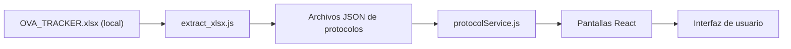

## Contexto del proyecto

SportMetric Academic es una app web (Vite + React + React Router) orientada a consulta guiada de protocolos de medición física/antropométrica.

### Stack

- Vite (compilación y servidor de desarrollo)
- React + React Router (navegación por rutas)
- Tailwind CSS (sistema visual)
- JSON como fuente principal de datos para protocolos
- Framer Motion para transiciones y retroalimentación visual
- Lucide React para iconografía

### Estructura (carpetas clave)

- `src/pages/Welcome.jsx`: bienvenida con logo principal.
- `src/pages/Categories.jsx`: categorías de protocolos.
- `src/pages/ProtocolList.jsx`: listado por categoría con barra de búsqueda.
- `src/pages/ProtocolDetail.jsx`: contenedor del protocolo (secciones internas + navegación) con carga diferida de secciones.
- `src/pages/protocol/*`: secciones individuales del protocolo.
- `src/services/protocolService.js`: carga/orden de protocolos desde JSON con JSDoc completo.
- `src/data/protocols/*.json`: contenido de protocolos oficiales (solo con `order` numérico).
- `src/components/ErrorBoundary.jsx`: manejo de errores inesperados.
- `src/App.jsx`: definición de rutas principales con carga diferida (`lazy`) para reducir el peso inicial y ErrorBoundary.
- `public/assets/logos`, `public/assets/images`, `public/assets/videos` y `public/assets/placeholders`: ubicación de recursos.
- `extract_xlsx.js`: herramienta para extraer/sincronizar JSON desde `OVA_TRACKER.xlsx` (archivo local; no se versiona en Git; dependencia `xlsx` eliminada del proyecto).
- `vitest.config.js` y `src/test/setup.js`: configuración de testing.

### Pipeline de datos (Mermaid)

### Seguridad (resumen)

- No se renderiza HTML “crudo” (no se usa `dangerouslySetInnerHTML`).
- No hay credenciales/keys en el código.
- Placeholders: se usan recursos embebidos (`data URI`) y assets locales para evitar dependencias externas y bloqueos del navegador.
- CSP (Content Security Policy): implementada en `index.html` para mitigar XSS.
- Headers de seguridad: configurados en `vite.config.js` para desarrollo y previsualización.
- Dependencias actualizadas: vulnerabilidades de `vite` corregidas y dependencia `xlsx` eliminada del proyecto.

### Comportamiento de la interfaz

- La aplicación está pensada con enfoque mobile-first.
- La navegación inferior se oculta automáticamente al entrar a un protocolo y también al hacer scroll hacia abajo, para liberar espacio útil en pantallas pequeñas.
- Los protocolos incluyen acciones explícitas de navegación para mejorar la accesibilidad, especialmente en usuarios que no dependen bien de iconos.

### Repositorio y despliegue

- La rama `main` se reserva para producción.
- La rama `dev` se usa para desarrollo e integración de cambios.
- `OVA_TRACKER.xlsx` no se incluye en Git; solo se conserva el resultado final en JSON dentro de `src/data/protocols/`.
