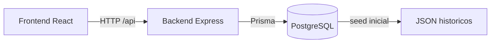
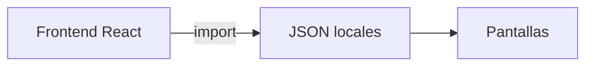

# Contexto del proyecto

SportMetric Academic es una plataforma web full stack orientada a la consulta guiada, captura y administracion de protocolos de medicion fisica y antropometrica. Combina una vista publica para visitantes y evaluadores, un sistema de autenticacion con recuperacion de contrasena, y un panel administrativo completo para CRUDs y analiticas.

## Stack

### Frontend

- React 19 + React Router 6 (rutas anidadas, `<Outlet />`, `ProtectedRoute`).
- Vite como bundler y servidor de desarrollo.
- Tailwind CSS para el sistema visual.
- Framer Motion para transiciones.
- Lucide React para iconografia.
- Recharts para los graficos del panel admin.
- Vitest + Testing Library + jsdom para pruebas.
- ESLint con plugin `react-hooks`.

### Backend

- Node.js 22.x con Express 5.
- TypeScript estricto en todo el codigo de aplicacion.
- Prisma 7 como ORM con PostgreSQL 16.
- Argon2 para hashing de contrasenas.
- `jsonwebtoken` para access y refresh tokens.
- Helmet con CSP estricta y CORS configurable.
- Pino para logging.
- Zod para validacion.
- Swagger / OpenAPI para documentacion interactiva.
- Vitest + Supertest para pruebas.

## Capas del backend

```
src/
  config/         (env, helmet, cors, rate-limit)
  modules/
    auth/         (login, refresh, logout, forgot/reset password)
    users/        (CRUD de usuarios)
    categories/   (CRUD de categorias)
    protocols/    (CRUD de protocolos con relaciones 1:N)
    forms/        (esquemas de formulario)
    evaluations/  (CRUD de evaluaciones)
    analytics/    (resumenes para el dashboard)
  shared/
    middlewares/  (authenticate, authorize, rate-limit)
    filters/      (error filter global)
    utils/        (ApiResponse, ApiError, logger, etc.)
```

Cada modulo sigue el patron:

```
controllers/  -> reciben request, formatean response
services/     -> logica de negocio, validaciones, transformaciones
repositories/ -> acceso a datos via Prisma
routes.ts     -> declaracion de endpoints
dtos/         -> tipos y esquemas de peticion/respuesta
utils/        -> helpers especificos del modulo
```

## Estructura del frontend

```
src/
  components/    (DynamicForm, ErrorBoundary, ProtectedRoute, etc.)
  layout/        (AdminLayout, AuthLayout, MainLayout)
  pages/
    Welcome.jsx
    Categories.jsx
    ProtocolList.jsx
    ProtocolDetail.jsx
    protocol/    (secciones individuales del detalle)
    auth/        (Login, ForgotPassword, ResetPassword)
    admin/       (Dashboard, Users, Categories, Protocols, Evaluations, Analytics)
  services/      (apiClient, xhrFactory, authService, evaluationService, formService, etc.)
  data/          (modo local: JSON de categorias y protocolos)
  test/          (suites de Vitest con fixtures)
```

## Pipeline de datos

### Modo `api` (produccion y desarrollo recomendado)


```mermaid
flowchart LR
  A[Frontend React] -->|HTTP /api| B[Backend Express]
  B -->|Prisma| C[(PostgreSQL)]
  C -->|seed inicial| D[JSON historicos]
```

- El seed inicial (`backend/prisma/seed.ts`) toma los JSON de `frontend/src/data/` y los persiste en PostgreSQL.
- A partir de ahi, todas las operaciones CRUD se hacen contra la API.
- El frontend puede seguir mostrando datos locales si `VITE_DATA_SOURCE=local`.

### Modo `local` (desarrollo visual sin backend)


```mermaid
flowchart LR
  A[Frontend React] -->|import| B[JSON locales]
  B --> C[Pantallas]
```

## Seguridad

- Contrasenas hasheadas con Argon2 (parametrizado para workstation).
- JWT firmados con `JWT_SECRET` y `JWT_REFRESH_SECRET` separados.
- Refresh tokens persistidos como hash en BD y rotacion automatica.
- Tokens de recuperacion: 32 bytes aleatorios, SHA-256 en BD, expiracion 1h, un solo uso.
- Helmet con CSP estricta, no se permiten `unsafe-inline` ni origines externos.
- CORS restringido a `ALLOWED_ORIGINS`.
- Rate limit por IP configurable.
- Middleware `authenticate` y `authorize('ROLE')` en todas las rutas protegidas.
- Cliente HTTP con `XMLHttpRequest` (inyectable via `xhrFactory.js`) para evitar bloqueos de extensiones del navegador que sobrescriben `fetch`.
- Headers anti-cache en endpoints que devuelven esquemas dinamicos.
- No se renderiza HTML crudo (sin `dangerouslySetInnerHTML`).
- No hay credenciales ni claves en el repositorio.

## Comportamiento de la interfaz

- Diseno mobile-first.
- La navegacion inferior se oculta automaticamente al entrar a un protocolo y al hacer scroll hacia abajo.
- El `DynamicForm` se remonta con un `key` derivado del esquema, lo que reinicia su estado al cambiar la configuracion.
- Separador visual "Campos personalizados" en el formulario cuando hay campos custom.
- Asterisco rojo (`*`) indica campos obligatorios.
- Banner informativo en la pestana "Registro" del editor de Protocolos.

## Repositorio y despliegue

- `main`: rama estable y de referencia.
- `dev`: integracion y evolucion del trabajo tecnico.
- `frontend/public/assets/`: logos, imagenes, videos y placeholders.
- `extract_xlsx.js` (opcional): herramienta local para sincronizar JSON desde `OVA_TRACKER.xlsx` (no se versiona).
- Recomendacion: frontend en Vercel, backend en Render, PostgreSQL en Render.
- Estrategia cloud-agnostic: cambiar de proveedor solo requiere modificar variables de entorno.
- `TRUST_PROXY_HOPS` debe ajustarse segun la cantidad de proxies reales delante del backend.
