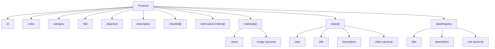

## Estructura de un protocolo (JSON)

Los protocolos viven en `src/data/protocols/*.json`. La app carga automáticamente solo los JSON “oficiales” que incluyen `order` numérico.

### Campos

- `id` (string): identificador único del protocolo en formato slug.
- `order` (number): orden global de carga y visualización.
- `category` (string): id de categoría (debe existir en `src/data/categories.js`).
- `title` (string): nombre visible.
- `objective` (string): objetivo del protocolo.
- `materials` (array): lista de materiales.
  - elemento: `{ "name": string, "image"?: string }`
- `description` (string): descripción general.
- `checklist` (array): lista de chequeo (strings).
- `steps` (array): pasos.
  - elemento: `{ "step": number, "title": string, "description": string, "video"?: string }`
- `interruptionCriteria` (array): criterios de interrupción (strings).
- `dataRegistry` (object): metadatos para el registro de datos.
  - ejemplo: `{ "title": "Registro de datos", "description": "...", "unit"?: "kg|cm|m|s|°|etapa" }`

### Reglas de visualización

- Materiales, checklist, pasos, criterios y registro son opcionales.
- Si un campo opcional está vacío (array vacío u objeto vacío), su sección no se muestra.
- El texto se muestra como texto plano, sin HTML incrustado.
- Los valores como `N/A`, `NA` o equivalentes deben limpiarse antes de publicar el JSON final.
- Si un paso incluye la propiedad `video`, la interfaz intenta reproducir ese recurso desde `public/assets/videos/` o desde la ruta configurada en el JSON.

### Diagrama de la estructura

