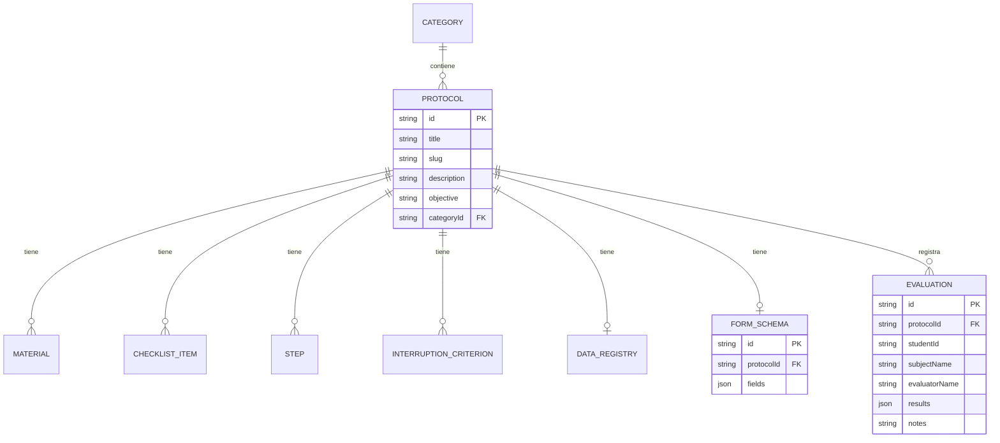

# Estructura de un Protocolo

Un Protocolo en SportMetric Academic se compone de campos directos y de relaciones 1:N persistidas en PostgreSQL mediante Prisma. Adicionalmente puede tener un esquema de formulario (`FormSchema`) que define campos personalizados configurables desde el panel administrativo.

## Modelo de datos (Prisma)

### `Protocol` (tabla principal)

| Campo | Tipo | Descripcion |
| --- | --- | --- |
| `id` | `String` (PK) | Identificador unico en formato slug (ej: `medicion-del-peso`). |
| `title` | `String` | Titulo visible del protocolo. |
| `slug` | `String` | Version slug del titulo para URLs amigables. |
| `description` | `String?` | Descripcion larga del protocolo. |
| `objective` | `String?` | Objetivo academico del protocolo. |
| `categoryId` | `String` (FK) | Referencia a `Category`. |
| `createdAt` / `updatedAt` | `DateTime` | Marcas de auditoria. |

### Relaciones 1:N

- `materials: Material[]` (ordenado por `order` ascendente).
- `checklistItems: ChecklistItem[]` (ordenado por `order` ascendente).
- `steps: Step[]` (ordenado por `order` ascendente).
- `interruptionCrit: InterruptionCriterion[]` (ordenado por `order` ascendente).
- `dataRegistry: DataRegistry?` (1:1, metadatos de la ficha de registro).

### Relacion 1:1

- `formSchema: FormSchema?` (1:1, contiene `fields` en JSONB).

## Tablas de relaciones

### `Material`

| Campo | Tipo | Descripcion |
| --- | --- | --- |
| `id` | `String` (PK) | |
| `protocolId` | `String` (FK) | |
| `name` | `String` | Nombre del material. |
| `image` | `String?` | URL o ruta local de la imagen. |
| `order` | `Int` | Posicion dentro del protocolo. |

### `ChecklistItem`

| Campo | Tipo | Descripcion |
| --- | --- | --- |
| `id` | `String` (PK) | |
| `protocolId` | `String` (FK) | |
| `text` | `String` | Texto del item. |
| `order` | `Int` | Posicion dentro del protocolo. |

### `Step`

| Campo | Tipo | Descripcion |
| --- | --- | --- |
| `id` | `String` (PK) | |
| `protocolId` | `String` (FK) | |
| `step` | `Int` | Numero de paso visible. |
| `title` | `String` | Titulo del paso. |
| `description` | `String` | Descripcion detallada. |
| `video` | `String?` | Ruta al video (opcional). |
| `order` | `Int` | Posicion dentro del protocolo. |

### `InterruptionCriterion`

| Campo | Tipo | Descripcion |
| --- | --- | --- |
| `id` | `String` (PK) | |
| `protocolId` | `String` (FK) | |
| `text` | `String` | Criterio de interrupcion. |
| `order` | `Int` | Posicion dentro del protocolo. |

### `DataRegistry`

| Campo | Tipo | Descripcion |
| --- | --- | --- |
| `id` | `String` (PK) | |
| `protocolId` | `String` (FK, UNIQUE) | Relacion 1:1. |
| `title` | `String` | Titulo de la ficha. |
| `description` | `String?` | Descripcion de la ficha. |
| `unit` | `String?` | Unidad por defecto (`kg`, `cm`, `m`, `s`, `°`, `etapa`). |
| `fields` | `Json` | Configuracion adicional de campos (JSONB). |

## FormSchema (esquema de formulario)

Es la pieza clave que permite al administrador definir campos personalizados sin modificar el backend.

| Campo | Tipo | Descripcion |
| --- | --- | --- |
| `id` | `String` (PK) | |
| `protocolId` | `String` (FK, UNIQUE) | Relacion 1:1 con `Protocol`. |
| `fields` | `Json` | Array de campos personalizados (JSONB). |

### Tipos de campo soportados

| `type` | Configuracion comun | Notas |
| --- | --- | --- |
| `text` | `label`, `placeholder?`, `required?` | Texto libre corto. |
| `number` | `label`, `unit?`, `min?`, `max?`, `step?`, `required?` | Valor numerico. |
| `date` | `label`, `required?` | Selector de fecha. |
| `textarea` | `label`, `placeholder?`, `required?` | Texto libre largo. |
| `select` | `label`, `options: string[]`, `required?` | Lista desplegable. |
| `checkbox` | `label`, `checkboxLabel?`, `required?` | Casilla de verificacion. |

### Ejemplo de `fields`

```json
[
  {
    "name": "frecuencia_cardiaca",
    "label": "Frecuencia cardiaca en reposo",
    "type": "number",
    "unit": "bpm",
    "required": true,
    "min": 30,
    "max": 220
  },
  {
    "name": "tipo_esfuerzo",
    "label": "Tipo de esfuerzo",
    "type": "select",
    "required": true,
    "options": ["Aerobico", "Anaerobico", "Mixto"]
  },
  {
    "name": "observaciones_medicas",
    "label": "Observaciones medicas",
    "type": "textarea",
    "required": false
  }
]
```

### Nombres reservados

Los nombres `id_estudiante`, `evaluado` y `evaluador` estan reservados porque el backend los agrega SIEMPRE como parte de la Ficha Tecnica base. El editor del panel admin valida que no se usen.

## Ficha Tecnica base (anadida por el backend)

Toda evaluacion incluye SIEMPRE estos 3 campos al inicio del esquema, sin importar si el admin definio campos personalizados o no:

| name | label | tipo | obligatorio |
| --- | --- | --- | --- |
| `id_estudiante` | ID del estudiante | text | si |
| `evaluado` | Nombre del evaluado | text | si |
| `evaluador` | Nombre del evaluador | text | si |

El backend concatena los campos base con los personalizados:

```ts
{
  isGeneric: true | false,    // true si no hay personalizados
  fields: [...GENERIC_FIELDS, ...customFields],
  protocolId: string
}
```

## Evaluaciones (resultados)

| Campo | Tipo | Descripcion |
| --- | --- | --- |
| `id` | `String` (PK) | |
| `protocolId` | `String` (FK) | Protocolo evaluado. |
| `studentId` | `String?` | Identificador externo del estudiante. |
| `subjectName` | `String?` | Snapshot del nombre del evaluado. |
| `evaluatorName` | `String?` | Snapshot del nombre del evaluador. |
| `results` | `Json` | Objeto con los valores capturados en el formulario. |
| `notes` | `String?` | Notas adicionales del evaluador. |
| `date` | `DateTime?` | Fecha de la evaluacion. |
| `createdAt` / `updatedAt` | `DateTime` | Marcas de auditoria. |

### Ejemplo de `results`

```json
{
  "id_estudiante": "EST-2024-001",
  "evaluado": "Juan Perez",
  "evaluador": "Ana Docente",
  "frecuencia_cardiaca": 72,
  "tipo_esfuerzo": "Aerobico",
  "observaciones_medicas": "Sin novedades."
}
```

## Diagrama entidad-relacion


```mermaid
erDiagram
    CATEGORY ||--o{ PROTOCOL : contiene
    PROTOCOL ||--o{ MATERIAL : tiene
    PROTOCOL ||--o{ CHECKLIST_ITEM : tiene
    PROTOCOL ||--o{ STEP : tiene
    PROTOCOL ||--o{ INTERRUPTION_CRITERION : tiene
    PROTOCOL ||--o| DATA_REGISTRY : tiene
    PROTOCOL ||--o| FORM_SCHEMA : tiene
    PROTOCOL ||--o{ EVALUATION : registra

    PROTOCOL {
      string id PK
      string title
      string slug
      string description
      string objective
      string categoryId FK
    }
    FORM_SCHEMA {
      string id PK
      string protocolId FK
      json fields
    }
    EVALUATION {
      string id PK
      string protocolId FK
      string studentId
      string subjectName
      string evaluatorName
      json results
      string notes
    }
```
